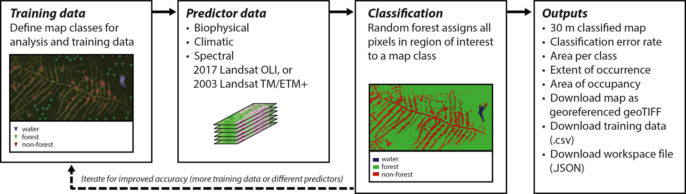
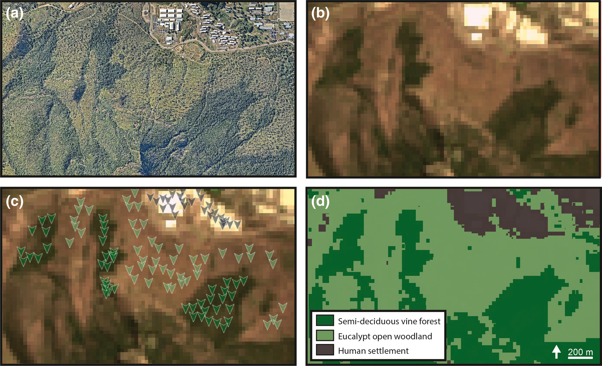

```{r setup, include=FALSE}
options(htmltools.dir.version = FALSE)
knitr::opts_chunk$set(
  fig.width=9, fig.height=3.5, fig.retina=3,
  out.width = "100%",
  cache = FALSE,
  echo = TRUE,
  message = FALSE, 
  warning = FALSE,
  hiline = TRUE
)

library(RefManageR)
BibOptions(check.entries = FALSE,
           bib.style = "authoryear",
           cite.style = "alphabetic",
           style = "markdown",
           hyperlink = FALSE,
           dashed = FALSE)
myBib <- ReadBib("bib/2_species.bib", check = FALSE)
```

```{r xaringan-themer, include=FALSE, warning=FALSE}
library(xaringanthemer)

# style_duo_accent(
#   primary_color = "#1381B0",
#   secondary_color = "#FF961C",
#   inverse_header_color = "#FFFFFF"
# )

style_mono_light(base_color = "#23395b")

#https://mycolor.space/?hex=%2323395B&sub=1 
#"Generic gradient" - #23395B #006287 #008E9D #00B897 #89DD81 #F9F871
#"Matching gradient" (reverse) - #23395B #494E77 #716292 #9C77AA #C88DBF #F5A3D0


library(knitr)
library(kableExtra)
```


```{r xaringan-tile-view, echo=FALSE}
# xaringanExtra::use_tile_view()
```

class: center, middle

### Practical: Mapping biodiversity

We'll be using [***remap***](https://remap-app.org/) to play with mapping ecosystems using satellite remote sensing.

Remap is an online mapping platform for people with little technical background in remote sensing. It enables you to quickly map and report the status of ecosystems, contributing to the IUCN Red List of Ecosystems.

The exercise is aimed at giving you greater insight into many of the challenges faced and assumptions or pragmatic decisions required when mapping and monitoring ecosystems.

---

class: center, middle

### Land cover classification with [***remap***](https://remap-app.org/)

```{r echo = F, fig.align = 'center', out.width = '100%'}

```

.center[from [Murray et al. 2019](https://doi.org/10.1111/2041-210X.13043)]

---

class: center, middle

### Land cover classification with [***remap***](https://remap-app.org/)

```{r echo = F, fig.align = 'center', out.width = '70%'}

```

.center[from [Murray et al. 2019](https://doi.org/10.1111/2041-210X.13043)]


---

### Steps

1. Open [***remap***](https://remap-app.org/)
2. Go to "tutorials", open and read through PDF Tutorials 1 and 2
3. Select an area you know reasonably well about the size of the Cape Peninsula (e.g. the Cape Peninsula)
4. Follow the instructions from tutorial 1, but for your area and time set to "present"
  - We will have a discussion around how best to collect your training data
5. Colour your classes something sensible 
 - take a screen shot of your classified map (for submission with your prac).
 - click "Results" and take a screen shot (for submission with your prac)
 - set your classification to semi-transparent, pan around and see how well your classifier has done
6. Consider ways to improve your classification and address issues you noticed by 
  - altering or adding to your training data (e.g. using a species or imagery-oriented approach)
  - adding or dropping predictors
7. Rerun your classification with your altered training data and repeat the screen shots in step 5 (you can redo this step a few times until you feel you have a reasonable classification)
8. Now switch the time setting to "past". 
  - check that your training data points have not changed (e.g. human-altered land cover) 
  - classify and take screen shots 
  - compare present and past classifications with slider as per tutorial 2
9. Export your data as a JSON file labelled with your name

---

### Assignment

Contextualise your answers by highlighting how they relate to the approach we adopted in this practical and/or illustrate them (i.e. provide figures with captions) with examples from your analyses - e.g. where your classifier did well or badly or changed with different settings or training data. 

1. What assumptions are required when using satellite remote sensing (SRS) to map ecosystems?
2. What are the potential drivers of uncertainty when using SRS to develop an ecosystem type classification?
3. What are the pros and cons of selecting your training data based on vegetation physiognomy versus the occurrence of focal species?
4. What are the implications of the issues raised above for how and what we conserve?

Each question is worth 4 marks and shouldn't be more than half a page (don't forget to illustrate your answers based on your results!!!). 6 marks are allocated for providing your figures and results with appropriate captions etc. An additional 2 marks will be awarded for providing appropriately cited and relevant references (and reference list). This brings the total mark allocation to **24 marks**. 6 marks come from your answers to the questions on the reading, resulting in 30 marks for the module.

Please provide your write-up as a ***PDF***. Please also submit your JSON file labelled with your name.

---
class: center, middle

# Thanks!

Slides created via the R packages:

[**xaringan**](https://github.com/yihui/xaringan)<br>
[gadenbuie/xaringanthemer](https://github.com/gadenbuie/xaringanthemer)

The chakra comes from [remark.js](https://remarkjs.com), [**knitr**](http://yihui.name/knitr), and [R Markdown](https://rmarkdown.rstudio.com).
