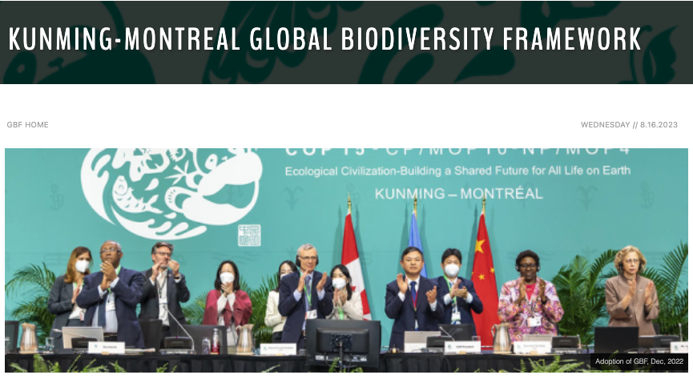
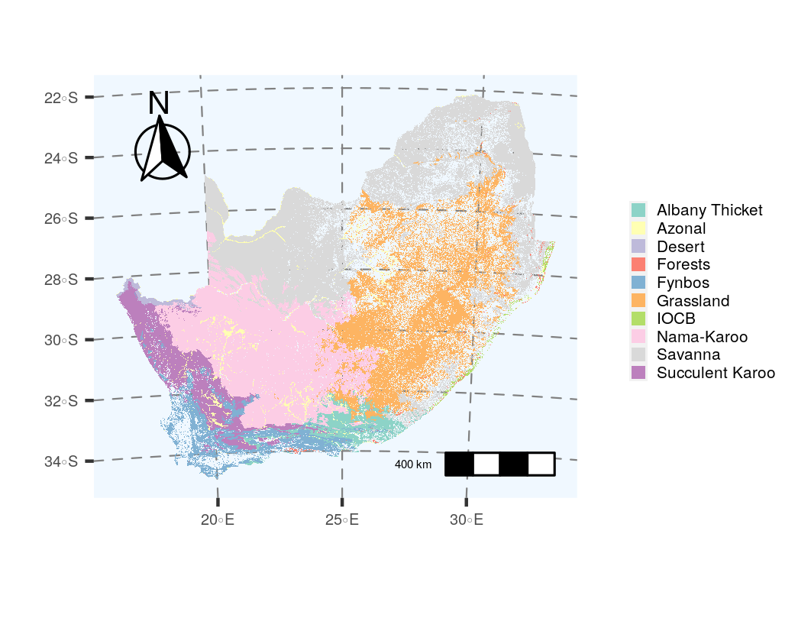
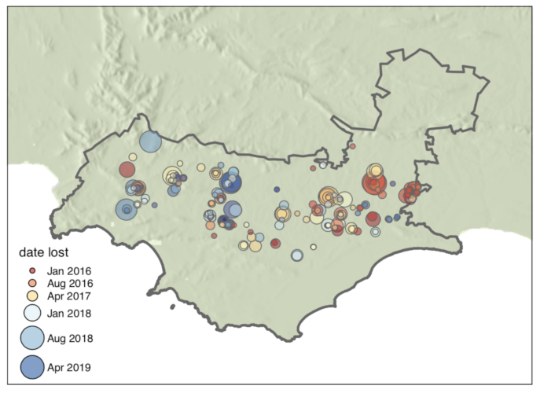
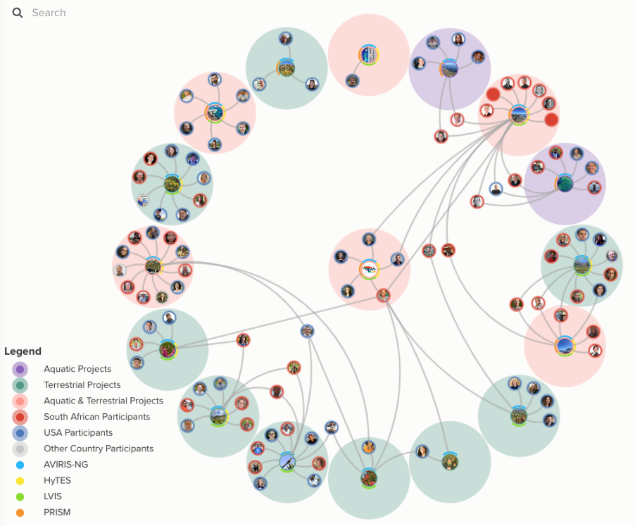
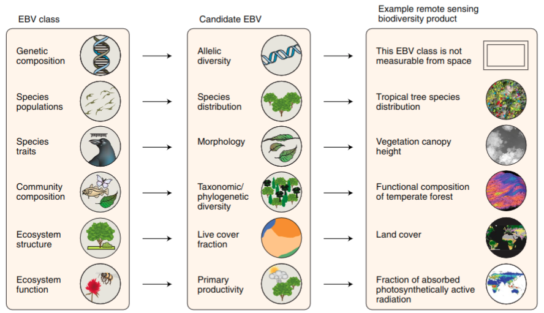
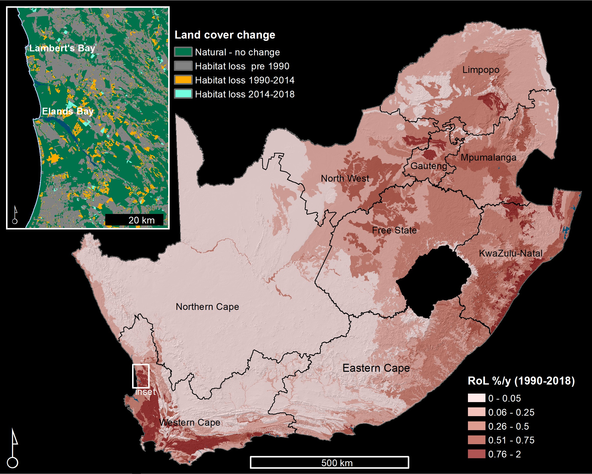
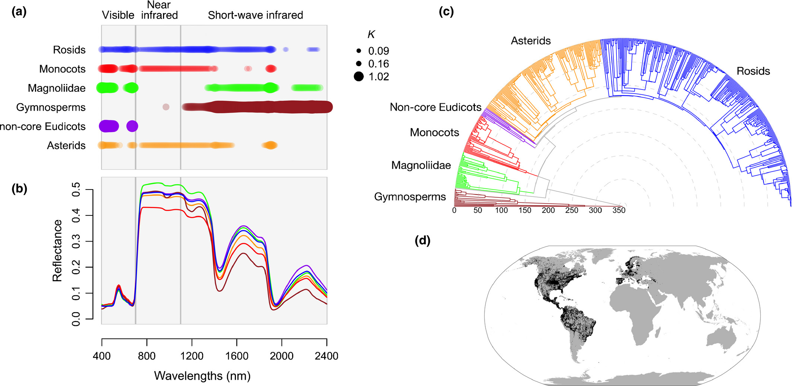

```{r setup, include=FALSE}
options(htmltools.dir.version = FALSE)
knitr::opts_chunk$set(
  fig.width=9, fig.height=3.5, fig.retina=3,
  out.width = "100%",
  cache = FALSE,
  echo = TRUE,
  message = FALSE, 
  warning = FALSE,
  hiline = TRUE
)

library(RefManageR)
BibOptions(check.entries = FALSE,
           bib.style = "authoryear",
           cite.style = "alphabetic",
           style = "markdown",
           hyperlink = FALSE,
           dashed = FALSE)
myBib <- ReadBib("bib/2_species.bib", check = FALSE)
```

```{r xaringan-themer, include=FALSE, warning=FALSE}
library(xaringanthemer)

# style_duo_accent(
#   primary_color = "#1381B0",
#   secondary_color = "#FF961C",
#   inverse_header_color = "#FFFFFF"
# )

style_mono_light(base_color = "#23395b")

#https://mycolor.space/?hex=%2323395B&sub=1 
#"Generic gradient" - #23395B #006287 #008E9D #00B897 #89DD81 #F9F871
#"Matching gradient" (reverse) - #23395B #494E77 #716292 #9C77AA #C88DBF #F5A3D0


library(knitr)
library(kableExtra)
```


```{r xaringan-tile-view, echo=FALSE}
# xaringanExtra::use_tile_view()
```

class: center, middle

background-color: black

text-color: white

```{r echo = F, fig.align = 'center', out.width = '50%'}
knitr::include_graphics("images/blue_marble.jpg")
```

---

background-color: black
background-image: url("images/earthrise.png")
background-size: contain

text-color: white

---

## "The Blue Marble" and "Earthrise"

.pull-left[

```{r echo = F, fig.align = 'left', out.width = '82%'}
knitr::include_graphics("images/blue_marble.jpg")
```

.footnote[Photo taken from the NASA Apollo 17 mission in 1972]
]

.pull_right[

<br>

These and other photographs taken by astronauts and early satellites in the late 1960s and early 1970s were among the first _earth observations_ from space.

They highlight Earth as a single vulnerable, interconnected system in the darkness of space with limited resources and no escape options...

They sparked a new era both in environmental consciousness and in the tools available to better understand and protect our environment.

]

---

## Learning goals for this lecture:

- To provide an introduction to this module
- To highlight that much of biodiversity conservation is a _spatial_ problem
- To give you some idea how Geographic Information Systems (GIS) and satellite remote sensing are used in conservation
- To ground the above with local examples

---
class: center

## Habitat loss and degradation have been the greatest threats to biodiversity

```{r echo = F, fig.align = 'centre', out.width = '80%'}

```

.footnote[from the [Red List of South African Plants](http://redlist.sanbi.org/stats.php)]

---
class: center

### Expanding protected areas has been the primary approach to stemming biodiversity loss

```{r echo = F, fig.align = 'centre', out.width = '65%'}
knitr::include_graphics("images/bendingthecurve.jpg")
```

.footnote[from [IIASA via Phys.org](https://phys.org/news/2020-09-biodiversity-loss.html)]

---
class: center

## Global protected areas

```{r echo = F, fig.align = 'centre', out.width = '80%'}
knitr::include_graphics("images/protected_areas_map.png")
```

.footnote[from [Bingham et al. 2019](http://dx.doi.org/10.1038/s41559-019-0869-3)]

---
class: center

## Change in protected area and OECM* coverage

```{r echo = F, fig.align = 'centre', out.width = '80%'}
knitr::include_graphics("images/protected_areas.png")
```

.footnote[*OECM = Other effective area-based conservation measures. Data sourced from [Protected Planet](https://livereport.protectedplanet.net/chapter-3) - reported in million km<sup>2<sup>]

---

class: center

## We have a new target of 30% protected by 2030...

```{r echo = F, fig.align = 'centre', out.width = '70%'}

```

.footnote[The signing of the [**Global Biodiversity Framework**, Dec 2022](https://www.cbd.int/gbf/)]

---
## But there are many tough questions...

- Where should we put (or expand) protected areas?
- How do we ensure the effectiveness of our protected areas?
- How do we protect biodiversity outside protected areas?

Answering these requires:
  - Mapping biodiversity
  - Identifying and assessing threats to biodiversity
  - Deciding on biodiversity conservation priorities
  - Optimising trade-offs in priorities for protected area design
  - Tools to inform management
    - Early warning systems
    - Monitoring change in biodiversity and other key variables (e.g. fire, land cover change, etc)


> _Most of these are inherently spatial problems, typically requiring use of GIS_

> _Most can benefit from satellite remote sensing_

---

layout: false

### Mapping biodiversity

.pull-left[

The biomes of South Africa...

```{r echo = F, fig.align = 'center', out.width = '100%'}
knitr::include_graphics("images/biomes.png")
```

.footnote[[Dayaram et al. 2019](https://doi.org/10.4102/abc.v49i1.2452)]
]

.pull-right[

Estimated plant species richness across South Africa

```{r echo = F, fig.align = 'center', out.width = '85%'}
knitr::include_graphics("images/cramer_verboom_2017.jpg")
```

.footnote[[Cramer and Verboom 2017](http://dx.doi.org/10.1111/jbi.12911)]

]

---

layout: false

### Assessing threats to biodiversity

.pull-left[

The remaining extent of the biomes of South Africa...

```{r echo = F, fig.align = 'center', out.width = '100%'}

```

.footnote[[Skowno et al. 2021](http://dx.doi.org/10.17159/sajs.2021/8182)]
]

.pull-right[

SA plant taxa of conservation concern

```{r echo = F, fig.align = 'center', out.width = '100%'}

```

.footnote[[Red List of South African Plants](http://redlist.sanbi.org/stats.php)]
]

---

layout: false

### Setting conservation priorities

.pull-left[

Biodiversity priority areas of South Africa...

```{r echo = F, fig.align = 'center', out.width = '100%'}

```

.footnote[[Driver et al. 2011](http://hdl.handle.net/20.500.12143/5795)]
]

.pull-right[

South Africa’s Red List of Terrestrial Ecosystems (RLEs)

```{r echo = F, fig.align = 'center', out.width = '100%'}
knitr::include_graphics("images/rle_SA_Skowno2021.webp")
```

.footnote[[Skowno and Monyeki 2021](http://dx.doi.org/10.3390/land10101048)]
]

---

layout: false

### Tools to inform management

.pull-left[

Fire history...

```{r echo = F, fig.align = 'center', out.width = '85%'}
knitr::include_graphics("images/firecount_MODIS.png")
```

.footnote[MODIS fire record 2000-2021 - made in [Google Earth Engine](https://earthengine.google.org/)]
]

.pull-right[

Near-real-time vegetation change

```{r echo = F, fig.align = 'center', out.width = '100%'}

```

.footnote[[Moncrieff 2021]() - _Global Overberg Ruens Renosterveld Watch_]
]

---

## The rest of this module:

### Practical this afternoon
### Tuesday: Area-Based Conservation
### Wednesday: 


---

class: center, middle

### Today's practical: Mapping biodiversity

We'll be using [***remap***](https://remap-app.org/) to play with mapping ecosystems using satellite remote sensing.

Remap is an online mapping platform for people with little technical background in remote sensing. It enables you to quickly map and report the status of ecosystems, contributing to the IUCN Red List of Ecosystems.

The exercise is aimed at giving you greater insight into many of the challenges faced and assumptions or pragmatic decisions required when mapping and monitoring ecosystems.

---

class: center, middle

### Land cover classification with [***remap***](https://remap-app.org/)

```{r echo = F, fig.align = 'center', out.width = '100%'}
knitr::include_graphics("images/remap_murray2019.jpg")
```

.center[from [Murray et al. 2019](https://doi.org/10.1111/2041-210X.13043)]

---

class: center, middle

### Land cover classification with [***remap***](https://remap-app.org/)

```{r echo = F, fig.align = 'center', out.width = '70%'}
knitr::include_graphics("images/remap_murray2019b.jpg")
```

.center[from [Murray et al. 2019](https://doi.org/10.1111/2041-210X.13043)]


---

### Steps

1. Open [***remap***](https://remap-app.org/)
2. Go to "tutorials", open and read through PDF Tutorials 1 and 2
3. Select an area you know reasonably well (e.g. the Cape Peninsula) about the size of the Cape Peninsula
4. Follow the instructions from tutorial 1, but for your area and time set to "present"
  - We will have a discussion around how best to collect your training data
5. Colour your classes something sensible 
 - take a screen shot of your classified map (for submission with your prac).
 - click "Results" and take a screen shot (for submission with your prac)
 - set your classification to semi-transparent, pan around and see how well your classifier has done
6. Consider ways to improve your classification and address issues you noticed by 
  - altering or adding to your training data (e.g. using a species-oriented approach)
  - adding or dropping predictors
7. Rerun your classification with your altered training data and repeat the screen shots in step 5 (you can redo this step a few times until you feel you have a reasonable classification)
8. Now switch the time setting to "past". 
  - check that your training data points have not changed (e.g. human-altered land cover) 
  - classify and take screen shots 
  - compare present and past classifications with slider as per tutorial 2
9. Export your data as a JSON file labelled with your name

---

### Assignment

Where possible, contextualise your answers by highlighting how they relate to the approach we adopted in this practical and/or illustrate them (i.e. provide figures with captions) with examples from your analyses - e.g. where your classifier did well or badly or changed with different settings or training data. 

1. What assumptions are required when using satellite remote sensing (SRS) to map ecosystems?
2. What are the potential drivers of uncertainty when using SRS to develop an ecosystem type classification?
3. What are the pros and cons of selecting your training data based on vegetation physiognomy versus the occurrence of focal species?
4. What are the implications of the issues raised above for how and what we conserve?

Each question is worth 5 marks and shouldn't be more than half a page. An additional 5 marks will be awarded for providing appropriately cited and relevant references (and reference list). This brings the total mark allocation to **25 marks**.

Please provide your write-up as a ***PDF***. Please also submit your JSON file labelled with your name.

---

class: center, middle

### We want to measure biodiversity everywhere, all the time...

```{r echo = F, fig.align = 'center', out.width = '80%'}
knitr::include_graphics("images/world_seasonality.gif")
```

.center[Remote sensing is pretty much the only way this can be achieved...]

---

layout: false

.pull-left[

## It's a rapidly growing field

```{r echo = F, fig.align = 'left', out.width = '90%'}
knitr::include_graphics("images/turner2003.png")
```

```{r echo = F, fig.align = 'left', out.width = '90%'}
knitr::include_graphics("images/satellitelaunches.jpg")
```

.footnote[Turner et al. 2003]
]

.pull-right[

```{r echo = F, fig.align = 'left', out.width = '75%'}
knitr::include_graphics("images/cavenderbares2020.png")
```
.footnote[Cavender-Bares et al. 2020]

]

---

class: center

```{r echo = F, fig.align = 'center', out.width = '100%'}
knitr::include_graphics("images/bioscape.png")
```
.left[.footnote[...and the Cape is about to be the epicentre of this endeavour - https://www.bioscape.io/]]

---

layout: false

## BioSCape: Biodiversity Survey of the Cape

.pull-left[

- $>$ 100 scientists and conservation practitioners
- 16 teams (mixed US, RSA, other)
- terrestrial and aquatic
- 2 planes
- 4 instruments (hyperspectral and LiDAR)
- fundamental and applied science

```{r echo = F, fig.align = 'center', out.width = '100%'}
knitr::include_graphics("images/bioscape_planes.png")
```

]

.pull-right[
```{r echo = F, fig.align = 'center', out.width = '100%'}

```
.footnote[www.bioscape.io]
]

---

class: center, middle

## But how do we actually measure biodiversity with remote sensing?

---

layout: false

.pull-left[
## There are many facets of biodiversity to measure!

<br>

An advantage of remote sensing is that it can directly measure the structure, composition and function of biodiversity... 

...at least from the scale of individuals up...

]

.pull-right[
```{r echo = F, fig.align = 'center', out.width = '100%'}
knitr::include_graphics("images/Noss_Biodiversity.png")
```
.footnote[Noss 1990, _Conservation Biology_]
]

---

layout: false

.pull-left[
## There are many facets of biodiversity to measure!

An advantage of remote sensing is that it can directly measure the structure, composition and function of biodiversity... 


```{r echo = F, fig.align = 'center', out.width = '120%'}

```
.footnote[Skidmore et al. 2021]

]

.pull-right[

```{r echo = F, fig.align = 'center', out.width = '90%'}
knitr::include_graphics("images/ebv_circle.png")
```


...at least from the scale of individuals up...

.footnote[https://geobon.org/]

]

---

class: center

##Productivity and Seasonality

```{r echo = F, fig.align = 'center', out.width = '80%'}
knitr::include_graphics("images/world_seasonality.gif")
```

---

class: center

##Land cover (and change)

```{r echo = F, fig.align = 'center', out.width = '50%'}

```

.left[.footnote[Skowno et al. 2021]]

---

class: center

##Land cover change detection

```{r echo = F, fig.align = 'center', out.width = '70%'}
knitr::include_graphics("images/renosterveld_planet.gif")
```

.left[.footnote[Moncrieff 2022]]

---

class: center

##Land cover change time series

```{r echo = F, fig.align = 'center', out.width = '60%'}
knitr::include_graphics("images/moilwe.png")
```

.left[.footnote[Moilwe et al. in prep]]

---

class: center, middle

## But what about metrics like species, functional and phylogenetic diversity?

---

layout: false

.pull-left[
## Functional diversity?

```{r echo = F, fig.align = 'center', out.width = '100%'}
knitr::include_graphics("images/peninsula_lidar.png")
```

Proteaceae shrubs (dark green) surrounded by low shrubs, forbs and graminoids at Silvermine, TMNP. 

.footnote[Data from City of Cape Town]

]

.pull-right[
```{r echo = F, fig.align = 'center', out.width = '100%'}
knitr::include_graphics("images/purkis_klemas2011_lidar.png")
```

Light detection and ranging (LiDAR) allows you to measure topography and the vertical structure of vegetation.

.footnote[Purkis and Klemas 2011]
]

---

layout: false

.pull-left[
## Functional diversity?

Imaging spectroscopy ("hyperspectral" remote sensing) allows direct measurement of leaf traits.

```{r echo = F, fig.align = 'left', out.width = '92%'}
knitr::include_graphics("images/cawse2021_spectra.png")
```

]

.pull-right[
```{r echo = F, fig.align = 'center', out.width = '100%'}
knitr::include_graphics("images/peninsula_hyperspec.png")
```
]

---

layout: false

## Phylogenetic diversity?

```{r echo = F, fig.align = 'center', out.width = '70%'}

```

.left[.footnote[Meireles et al. 2020]]

Leaf spectra are phylogenetically conserved for some regions, so it's possible that we'll be able to discern lineages using imaging spectroscopy...

---

layout: false

.pull-left[
## Identifying species?

We can monitor populations of large species..., but identifying all species present...?

```{r echo = F, fig.align = 'center', out.width = '70%'}
knitr::include_graphics("images/machine_learning.png")
```

.footnote[https://xkcd.com/1838/]
]

.pull-right[
```{r echo = F, fig.align = 'center', out.width = '75%'}
knitr::include_graphics("images/cedars_pic.png")
knitr::include_graphics("images/cedars_mapped.png")
```

.footnote[Hadebe 2021 MSc thesis]
]

---

class: center

##There are challenges and limitations...

```{r echo = F, fig.align = 'center', out.width = '50%'}
knitr::include_graphics("images/schimel2020_scale.png")
```

.left[.footnote[Schimel et al. 2020]]

---

class: center

##But this is what fancy modelling and proxies are for...

```{r echo = F, fig.align = 'center', out.width = '43%'}
knitr::include_graphics("images/jetz2016.png")
```

.left[.footnote[Jetz et al. 2016]]

---

layout: false

.pull-left[
## Combining remote sensing and in situ data

Using remotely sensed environmental data to inform species distribution models

```{r echo = F, fig.align = 'center', out.width = '100%'}
knitr::include_graphics("images/wilson2016.png")
```

E.g. Observed cloud frequency from the MODIS satellite is a better predictor of the distribution of _Protea cynaroides_ than interpolated precipitation.

.footnote[Wilson and Jetz 2016]

]

.pull-right[
```{r echo = F, fig.align = 'center', out.width = '100%'}
knitr::include_graphics("images/randin2020.jpg")
```
.footnote[Randin et al. 2020]
]

---

layout: false

.pull-left[
## The Spectral Diversity Hypothesis

Is spectral diversity a good proxy for biotic diversity?

```{r echo = F, fig.align = 'left', out.width = '100%'}
knitr::include_graphics("images/frye2021map.png")
```

]

.pull-right[
```{r echo = F, fig.align = 'center', out.width = '90%'}
knitr::include_graphics("images/frye2021fig.png")
```

A test looking at spectral diversity from leaf spectra for 1210 species across 1267 plots supports the hypothesis **at the leaf level...**

.footnote[Frye et al. 2021]
]

---

layout: false

.pull-left[
## The Spectral Diversity Hypothesis


```{r echo = F, fig.align = 'left', out.width = '85%'}
knitr::include_graphics("images/vanleeuwen2020_scale.png")
```

]

.pull-right[
```{r echo = F, fig.align = 'center', out.width = '70%'}
knitr::include_graphics("images/vanleeuwen2020b.png")
```

But canopy reflectance is more complex...

Leaf angle, shadow, density, etc affect the spectral reflectance of vegetation, reducing our ability to identify and map species - especially as the resolution of the imagery coarsens.

.footnote[van Leeuwen et al. 2021]
]

---

layout: false

.pull-left[
### Environmental heterogeneity

Another approach is just to map and monitor environmental heterogeneity

####_"Conserving nature's stage"_

The Nature Conservancy and others using this approach to identify parcels of Earth that are valuable for their capacity to support diverse life forms today and into the future

Typically identified based on their abiotic heterogeneity or geodiversity, much of which can be mapped and/or monitored with remote sensing - topography, climate, soils, etc

]

.pull-right[
```{r echo = F, fig.align = 'center', out.width = '90%'}
knitr::include_graphics("images/humboldt.jpg")
```
.footnote[Alexander von Humboldt]
]

---
class: middle

## Take-home

>*There are many ways to measure biodiversity. None are perfect. You should treat them as hypotheses.*

>*How you measure biodiversity can affect the outcome of your study. There are many ways to measure biodiversity incorrectly for the application at hand!*

>*Measures of biodiversity allow us to explore:*
> - *How biodiversity is generated and communities are assembled*
> - *How biodiversity affects ecosystem functions, including benefits to society*
> - *How the environment is changing with time and human impacts*

>*Community assembly, biotic effects on ecosystem function, and responses to global change are tightly intertwined*

---

## References

```{r refs, echo=FALSE, results="asis"}
NoCite(myBib)
PrintBibliography(myBib)
```

---
class: center, middle

# Thanks!

Slides created via the R packages:

[**xaringan**](https://github.com/yihui/xaringan)<br>
[gadenbuie/xaringanthemer](https://github.com/gadenbuie/xaringanthemer)

The chakra comes from [remark.js](https://remarkjs.com), [**knitr**](http://yihui.name/knitr), and [R Markdown](https://rmarkdown.rstudio.com).
