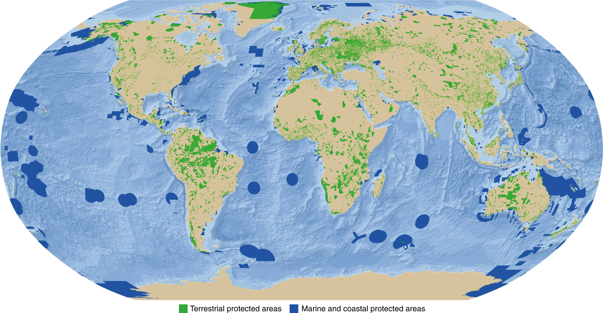

```{r setup, include=FALSE}
options(htmltools.dir.version = FALSE)
knitr::opts_chunk$set(
  fig.width=9, fig.height=3.5, fig.retina=3,
  out.width = "100%",
  cache = FALSE,
  echo = TRUE,
  message = FALSE, 
  warning = FALSE,
  hiline = TRUE
)

library(RefManageR)
BibOptions(check.entries = FALSE,
           bib.style = "authoryear",
           cite.style = "alphabetic",
           style = "markdown",
           hyperlink = FALSE,
           dashed = FALSE)
myBib <- ReadBib("bib/2_species.bib", check = FALSE)
```

```{r xaringan-themer, include=FALSE, warning=FALSE}
library(xaringanthemer)

# style_duo_accent(
#   primary_color = "#1381B0",
#   secondary_color = "#FF961C",
#   inverse_header_color = "#FFFFFF"
# )

style_mono_light(base_color = "#23395b")

#https://mycolor.space/?hex=%2323395B&sub=1 
#"Generic gradient" - #23395B #006287 #008E9D #00B897 #89DD81 #F9F871
#"Matching gradient" (reverse) - #23395B #494E77 #716292 #9C77AA #C88DBF #F5A3D0


library(knitr)
library(kableExtra)
```


```{r xaringan-tile-view, echo=FALSE}
# xaringanExtra::use_tile_view()
```

class: center, middle

background-color: black

text-color: white

```{r echo = F, fig.align = 'center', out.width = '50%'}
knitr::include_graphics("images/blue_marble.jpg")
```

???

Can anyone tell me what this picture is?

---

background-color: black
background-image: url("images/earthrise.png")
background-size: contain

text-color: white

???

And this one?

What would you call it?

---

## "The Blue Marble" and "Earthrise"

.pull-left[

```{r echo = F, fig.align = 'left', out.width = '82%'}
knitr::include_graphics("images/blue_marble.jpg")
```

.footnote[Photo taken from the NASA Apollo 17 mission in 1972]
]

.pull_right[

<br>

These and other photographs taken by astronauts and early satellites in the late 1960s and early 1970s were among the first _earth observations_ from space.

They helped establish a link between space and conservation almost immediately.

By highlighting Earth as a single vulnerable, interconnected system in the darkness of space with limited resources and no escape options, these pictures sparked a new era in _environmental consciousness_ and the need to better understand and protect our environment.

]

---
class: center

## Habitat loss and degradation have been the greatest threats to biodiversity

```{r echo = F, fig.align = 'centre', out.width = '80%'}
knitr::include_graphics("images/redlistSA_threats.png")
```

dominant threats to species from the [Red List of South African Plants](http://redlist.sanbi.org/stats.php)

???

The biggest threats to biodiversity to date have been directly linked to the conversion of or impact on habitats, and are typically explicit in space (i.e. area).

Threats like climate change or atmospheric pollution are less specifically area-focused, in that their effects occur almost everywhere, but they are still impending crises and have not been the biggest drivers of biodiversity loss to date.

---
class: center

### Area-based conservation has been the primary approach to stemming biodiversity loss and attempting to "bend the curve"

```{r echo = F, fig.align = 'centre', out.width = '65%'}
knitr::include_graphics("images/bendingthecurve.jpg")
```

from [IIASA via Phys.org](https://phys.org/news/2020-09-biodiversity-loss.html), based on [Leclere et al. 2020](https://doi.org/10.1038/s41586-020-2705-y)

???

Conservation areas have been key in stemming biodiversity loss, and will continue to be, even in the face of climate change.

---
class: center

## Global protected areas

```{r echo = F, fig.align = 'centre', out.width = '80%'}

```

.footnote[from [Bingham et al. 2019](http://dx.doi.org/10.1038/s41559-019-0869-3)]

???

Large parts of the globe are protected for conservation.

---
class: center

## Change in protected area and OECM* coverage

```{r echo = F, fig.align = 'centre', out.width = '80%'}
knitr::include_graphics("images/protected_areas.png")
```

*OECM = Other effective area-based conservation measures. Targets are for Aichi Target 11 (by 2020). 

Data from [Protected Planet](https://livereport.protectedplanet.net/chapter-3) - reported in million km<sup>2<sup>.

???

And global conservation goals aim to increase that coverage.

---

class: center

## We have a current target of 30% protected by 2030...

```{r echo = F, fig.align = 'centre', out.width = '70%'}
knitr::include_graphics("images/kunming.png")
```

.footnote[The signing of the [**Global Biodiversity Framework**, Dec 2022](https://www.cbd.int/gbf/)]

---
## But there are many tough questions...

- Where should we put (or expand) protected areas?
- How do we ensure the effectiveness of our protected areas?
- How do we protect biodiversity outside protected areas?

--

Answering these requires:
  - Mapping biodiversity
  - Identifying and assessing threats to biodiversity
  - Deciding on biodiversity conservation priorities
  - Optimising trade-offs in priorities for protected area design
  - Tools to inform management
    - Early warning systems
    - Monitoring change in biodiversity and other key variables (e.g. fire, land cover change, etc)

--

> _Most of these are inherently spatial problems, typically requiring use of GIS_

> _Most can benefit from satellite remote sensing_

---

layout: false

### Mapping biodiversity

.pull-left[

The biomes of South Africa...

```{r echo = F, fig.align = 'center', out.width = '100%'}
knitr::include_graphics("images/biomes.png")
```

.footnote[[Dayaram et al. 2019](https://doi.org/10.4102/abc.v49i1.2452)]
]

.pull-right[

Estimated plant species richness across South Africa

```{r echo = F, fig.align = 'center', out.width = '85%'}
knitr::include_graphics("images/cramer_verboom_2017.jpg")
```

.footnote[[Cramer and Verboom 2017](http://dx.doi.org/10.1111/jbi.12911)]

]

???

We need to map the biodiversity we aim to protect.

---

layout: false

### Assessing threats to biodiversity

.pull-left[

The remaining extent of the biomes of South Africa...

```{r echo = F, fig.align = 'center', out.width = '100%'}
knitr::include_graphics("images/biome_remnants.png")
```

.footnote[[Skowno et al. 2021](http://dx.doi.org/10.17159/sajs.2021/8182)]
]

.pull-right[

SA plant taxa of conservation concern

```{r echo = F, fig.align = 'center', out.width = '100%'}
knitr::include_graphics("images/redlist_map.png")
```

.footnote[[Red List of South African Plants](http://redlist.sanbi.org/stats.php)]
]

???

And assess where that biodiversity faces the greatest threat...

---

layout: false

### Setting conservation priorities

.pull-left[

South Africa's biodiversity priority areas...

```{r echo = F, fig.align = 'center', out.width = '100%'}
knitr::include_graphics("images/Biodiversity_priority_areas_SA_2011.png")
```

.footnote[[Driver et al. 2011](http://hdl.handle.net/20.500.12143/5795)]
]

.pull-right[

South Africa’s Red List of Terrestrial Ecosystems (RLEs)

```{r echo = F, fig.align = 'center', out.width = '100%'}

```

.footnote[[Skowno and Monyeki 2021](http://dx.doi.org/10.3390/land10101048)]
]

???

These maps are used to guide conservation action.

---

layout: false

### Tools to inform management

.pull-left[

Fire history...

```{r echo = F, fig.align = 'center', out.width = '85%'}

```

.footnote[MODIS fire record 2000-2021 - made in [Google Earth Engine](https://earthengine.google.org/)]
]

.pull-right[

Near-real-time vegetation change

```{r echo = F, fig.align = 'center', out.width = '100%'}
knitr::include_graphics("images/moncrieff2021b.png")
```

.footnote[[Moncrieff 2021]() - _Global Overberg Ruens Renosterveld Watch_]
]

???

And remote sensing can provide valuable tools for monitoring and managing biodiversity in our priority and/or protected areas.

---

class: middle

## Take-home

>*Much of biodiversity conservation is a _spatial_ problem*

>*The primary approach to conserving biodiversity is expanding and maintaining protected areas*

>*Expanding and maintaining protected areas requires answering many tough questions like:* 

>   - *"Where should we prioritise expansion?"*
>   - *"How do we maintain effective protected areas?"*
>   - *"What about biodiversity outside protected areas?"*

>*Geographic Information Systems (GIS) and satellite remote sensing are used extensively in conservation to help address these issues.*

---

## The rest of this module:

### This week

- Practical this afternoon!
- Tuesday: Area-Based Conservation
- Wednesday: Threat assessments
- Thursday: Remote Sensing of Biodiversity
- Friday: Guest lecture by Dr Andrew Skowno (SANBI)

### Next week

- Monday: Discussion of Gurney et al. 2023
- Tuesday: Guest lecture by Dr Ralph Watson, UCT
- Wednesday: Guest lecture by Dr Glenn Moncrieff, The Nature Conservancy
- Thursday & Friday [TBC]

---

class: center, middle

### Practical: Mapping biodiversity

We'll be using [***remap***](https://remap-app.org/) to play with mapping ecosystems using satellite remote sensing.

Remap is an online mapping platform for people with little technical background in remote sensing. It enables you to quickly map and report the status of ecosystems, contributing to the IUCN Red List of Ecosystems.

The exercise is aimed at giving you greater insight into many of the challenges faced and assumptions or pragmatic decisions required when mapping and monitoring ecosystems.

---

class: center, middle

### Land cover classification with [***remap***](https://remap-app.org/)

```{r echo = F, fig.align = 'center', out.width = '100%'}

```

.center[from [Murray et al. 2019](https://doi.org/10.1111/2041-210X.13043)]

---

class: center, middle

### Land cover classification with [***remap***](https://remap-app.org/)

```{r echo = F, fig.align = 'center', out.width = '70%'}

```

.center[from [Murray et al. 2019](https://doi.org/10.1111/2041-210X.13043)]


---

### Steps

1. Open [***remap***](https://remap-app.org/)
2. Go to "tutorials", open and read through PDF Tutorials 1 and 2
3. Select an area you know reasonably well about the size of the Cape Peninsula (e.g. the Cape Peninsula)
4. Follow the instructions from tutorial 1, but for your area and time set to "present"
  - We will have a discussion around how best to collect your training data
5. Colour your classes something sensible 
 - take a screen shot of your classified map (for submission with your prac).
 - click "Results" and take a screen shot (for submission with your prac)
 - set your classification to semi-transparent, pan around and see how well your classifier has done
6. Consider ways to improve your classification and address issues you noticed by 
  - altering or adding to your training data (e.g. using a species-oriented approach)
  - adding or dropping predictors
7. Rerun your classification with your altered training data and repeat the screen shots in step 5 (you can redo this step a few times until you feel you have a reasonable classification)
8. Now switch the time setting to "past". 
  - check that your training data points have not changed (e.g. human-altered land cover) 
  - classify and take screen shots 
  - compare present and past classifications with slider as per tutorial 2
9. Export your data as a JSON file labelled with your name

---

### Assignment

Contextualise your answers by highlighting how they relate to the approach we adopted in this practical and/or illustrate them (i.e. provide figures with captions) with examples from your analyses - e.g. where your classifier did well or badly or changed with different settings or training data. 

1. What assumptions are required when using satellite remote sensing (SRS) to map ecosystems?
2. What are the potential drivers of uncertainty when using SRS to develop an ecosystem type classification?
3. What are the pros and cons of selecting your training data based on vegetation physiognomy versus the occurrence of focal species?
4. What are the implications of the issues raised above for how and what we conserve?

Each question is worth 4 marks and shouldn't be more than half a page (don't forget to illustrate your answers based on your results!!!). 6 marks are allocated for providing your figures and results with appropriate captions etc. An additional 2 marks will be awarded for providing appropriately cited and relevant references (and reference list). This brings the total mark allocation to **24 marks**. 6 marks come from your answers to the questions on the reading, resulting in 30 marks for the module.

Please provide your write-up as a ***PDF***. Please also submit your JSON file labelled with your name.

---
class: center, middle

# Thanks!

Slides created via the R packages:

[**xaringan**](https://github.com/yihui/xaringan)<br>
[gadenbuie/xaringanthemer](https://github.com/gadenbuie/xaringanthemer)

The chakra comes from [remark.js](https://remarkjs.com), [**knitr**](http://yihui.name/knitr), and [R Markdown](https://rmarkdown.rstudio.com).
