```{r setup, include=FALSE}
options(htmltools.dir.version = FALSE)
knitr::opts_chunk$set(
  fig.width=9, fig.height=3.5, fig.retina=3,
  out.width = "100%",
  cache = FALSE,
  echo = TRUE,
  message = FALSE, 
  warning = FALSE,
  hiline = TRUE
)

# library(RefManageR)
# BibOptions(check.entries = FALSE,
#            bib.style = "authoryear",
#            cite.style = "alphabetic",
#            style = "markdown",
#            hyperlink = FALSE,
#            dashed = FALSE)
# myBib <- ReadBib("bib/2_area.bib", check = FALSE)
```

```{r xaringan-themer, include=FALSE, warning=FALSE}
library(xaringanthemer)

# style_duo_accent(
#   primary_color = "#1381B0",
#   secondary_color = "#FF961C",
#   inverse_header_color = "#FFFFFF"
# )

style_mono_light(base_color = "#23395b")

#https://mycolor.space/?hex=%2323395B&sub=1 
#"Generic gradient" - #23395B #006287 #008E9D #00B897 #89DD81 #F9F871
#"Matching gradient" (reverse) - #23395B #494E77 #716292 #9C77AA #C88DBF #F5A3D0


library(knitr)
library(kableExtra)
```


```{r xaringan-tile-view, echo=FALSE}
# xaringanExtra::use_tile_view()
```

class: center

## "Protecting area"

```{r echo = F, fig.align = 'centre', out.width = '85%'}
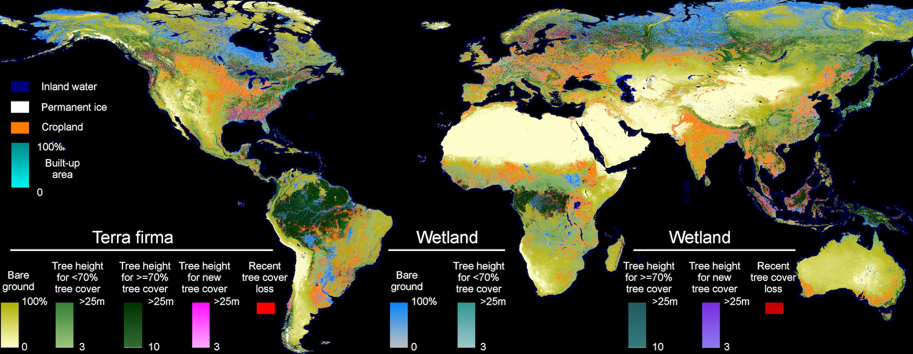
```

Habitat loss is the biggest driver of biodiversity loss.

.footnote[Land Cover from [Hansen et al. 2022](https://doi.org/10.1088/1748-9326/ac46ec). Interactive online [***here.***](https://glad.earthengine.app/view/global-land-cover-land-use-v1)]

---
class: center

##  "Protecting area" 

```{r echo = F, fig.align = 'centre', out.width = '70%'}
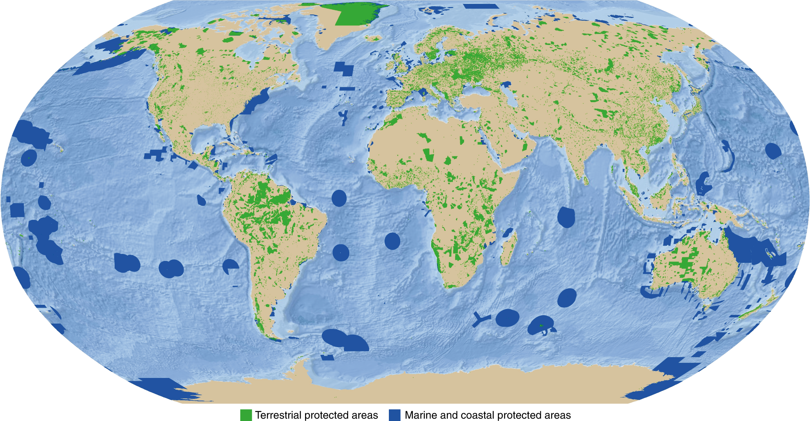
```

Habitat protection should be the most effective means to stem this loss.

.footnote[Global protected areas from [Bingham et al. 2019](http://dx.doi.org/10.1038/s41559-019-0869-3)]

---

layout: false

.pull-left[
## Why protect area?

#### The number of species increases with area...

**The species-area relationship** is described by the **species-area curve**, a graphical relationship in which increases in area ( $A$ ) are associated with increases in the number of species ( $S$ ). 

The curve can be described by the equation $S = cA^z$, where $c$ and $z$ are constants fitted to the data.

Taking the logarithm of both sides makes the relationship linear $log S = log C + z log A$.

The relationship holds for a wide range of ecosystems with many different types of organisms.
]

.pull-right[

```{r echo = F, fig.align = 'center', out.width = '75%'}
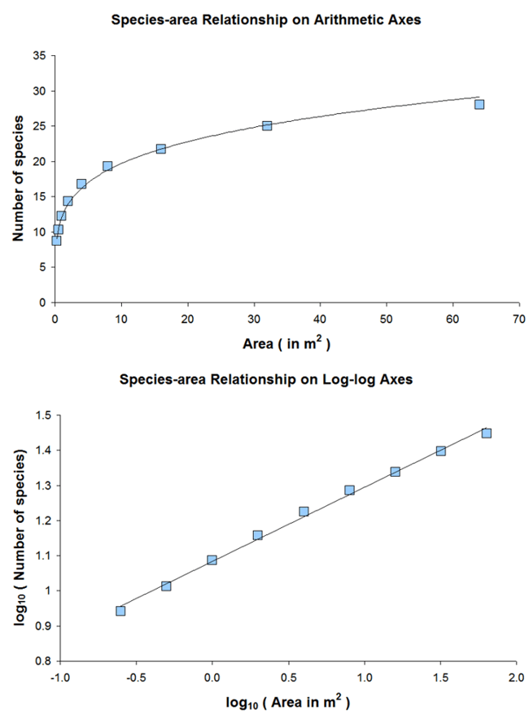
```

.footnote[Image: [**Wikipedia**](https://en.wikipedia.org/wiki/Species%E2%80%93area_relationship#)]

]

---

class: center

## Most agree that protecting area is a good idea...

```{r echo = F, fig.align = 'centre', out.width = '70%'}
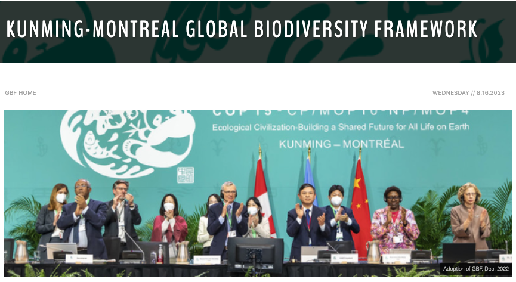
```

.footnote[The signing of the [**Global Biodiversity Framework**, Dec 2022](https://www.cbd.int/gbf/)]

---

class: center

## The [Global Biodiversity Framework](https://www.cbd.int/gbf/)

```{r echo = F, fig.align = 'centre', out.width = '70%'}
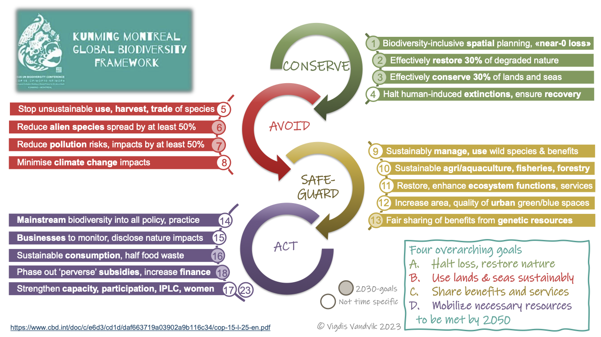
```

---

## The [Global Biodiversity Framework](https://www.cbd.int/gbf/)

#### 4 goals for 2050 and 23 targets for 2030 - and many focus on _area_

The first part of Goal A:
> _"The integrity, connectivity and resilience of all ecosystems are maintained, enhanced, or restored, substantially **increasing the area** of natural ecosystems by 2050"_

Targets 1, 2 and 3 are all area-centric:
> Target 1: _"...to bring the loss of **areas** of high biodiversity importance...close to zero by 2030..."_

> Target 2: _"...by 2030 at least 30 per cent of **areas** of degraded terrestrial, inland water, and marine and coastal ecosystems are under effective restoration..."_

> Target 3: _"...by 2030 at least 30 per cent of terrestrial and inland water areas, and of marine and coastal areas... are effectively conserved and managed [in] **protected areas** and other effective area-based conservation measures..."_ 

[***Target 3 is the so-called 30x30 goal***](https://www.30x30.solutions/)

---

#### Before the [Global Biodiversity Framework...](https://www.cbd.int/gbf/)

## [The Strategic Plan for Biodiversity 2011-2020](https://www.cbd.int/sp)

#### Includes the [Aichi Biodiversity Targets](https://www.cbd.int/sp/targets)

- Strategic Goal A: Address the underlying causes of biodiversity loss by mainstreaming biodiversity across government and society
- Strategic Goal B: Reduce the direct pressures on biodiversity and promote sustainable use
- Strategic Goal C: To improve the status of biodiversity by safeguarding ecosystems, species and genetic diversity
    - Target 11: _By 2020, at least **17 per cent of terrestrial and inland water, and 10 per cent of coastal and marine areas**, especially areas of particular importance for biodiversity and ecosystem services, are conserved through effectively and equitably managed, ecologically representative and well connected systems of **protected areas and OECMs**, and integrated into the wider landscapes and seascapes._
- Strategic Goal D: Enhance the benefits to all from biodiversity and ecosystem services
- Strategic Goal E: Enhance implementation through participatory planning, knowledge management and capacity building

.footnote[Note that many other targets are area-focussed, such as reducing rate of loss of habitats.]

---

#### Before [the Strategic Plan for Biodiversity 2011-2020...](https://www.cbd.int/sp)

## [The 2010 Biodiversity Target](https://www.cbd.int/2010-target) (7 focal areas)

- _**Reducing the rate of loss**_ of the components of biodiversity, including: (i) biomes, habitats and ecosystems; (ii) species and populations; and (iii) genetic diversity;
    - Target 1.1: At least 10% of each of the world's ecological regions effectively conserved.
    - Target 1.2: Areas of particular importance to biodiversity protected
- Promoting sustainable use of biodiversity;
- Addressing the major threats to biodiversity, including those arising from invasive alien species, climate change, pollution, and habitat change;
- Maintaining ecosystem integrity, and the provision of goods and services provided by biodiversity in ecosystems, in support of human well-being;
- Protecting traditional knowledge, innovations and practices;
- Ensuring the fair and equitable sharing of benefits arising out of the use of genetic resources; and
- Mobilizing financial and technical resources, especially for developing countries, in particular least developed countries and small island developing States among them, and countries with economies in transition, for implementing the Convention and the Strategic Plan.

.footnote[Note that these earlier agreements set targets for social equity and economic issues too.]

---

class: center, middle

## But there are many challenges:

We can't protect it all...

_We have to balance trade-offs with other human needs for (or rights to!) land and resources._

<br>

Where or how much do we need to protect? 

_What should we protect? How do we decide?_

<br>

What is "protection"? 

_How do we ensure it is effective?_

---

class: center

## We can't protect it all...

```{r echo = F, fig.align = 'centre', out.width = '85%'}

```

Habitat loss occurs because we need space to live, grow food, etc....

.footnote[Land Cover from [Hansen et al. 2022](https://doi.org/10.1088/1748-9326/ac46ec). Interactive online [***here.***](https://glad.earthengine.app/view/global-land-cover-land-use-v1)]

---

layout: false

.pull-left[
## Some areas are more diverse than others...

The number of species increases with area, but the species-area relationship varies depending on the **area** being sampled... 

```{r echo = F, fig.align = 'center', out.width = '70%'}
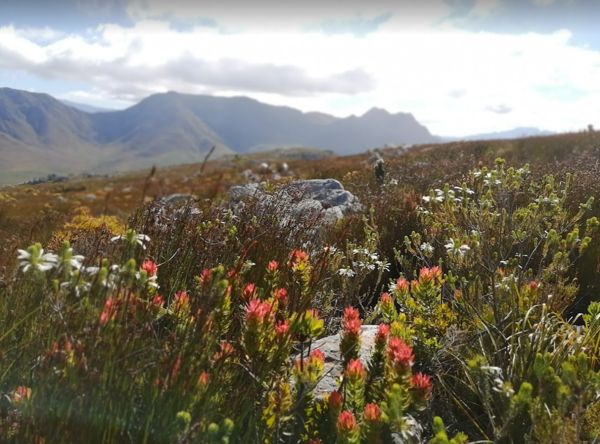
```

In fact, we often compare the diversity of different regions using species-area curves...

]

.pull-right[

```{r echo = F, fig.align = 'center', out.width = '70%'}
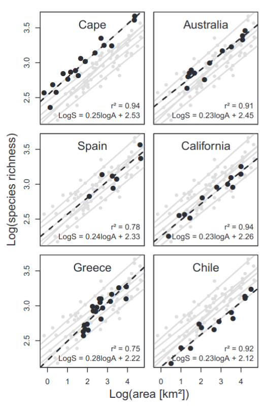
```

.footnote[[Cowling et al. 2015](http://dx.doi.org/10.1111/jbi.12429) comparison of Med-Type Ecosystems.]
]

---

## Where or how much do we need to protect? 

### Some areas are more diverse than others...

```{r echo = F, fig.align = 'center', out.width = '80%'}
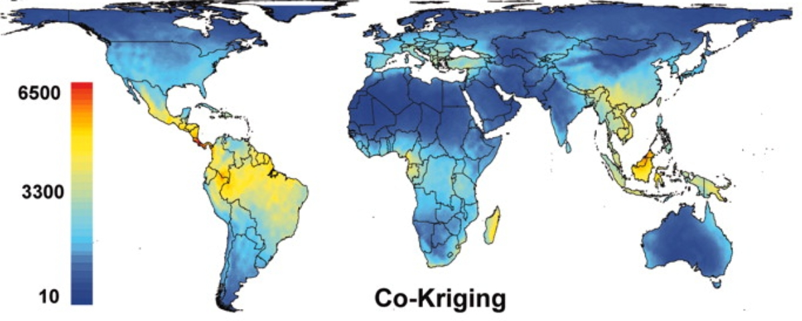
```
.footnote[Interpolated ("spatially estimated") global plant species richness - [Kreft & Jetz 2007](http://dx.doi.org/10.1073/pnas.0608361104), _PNAS_]

---

## Where or how much do we need to protect? 

#### There are many ways to set conservation priorities!!!

```{r echo = F, fig.align = 'center', out.width = '70%'}
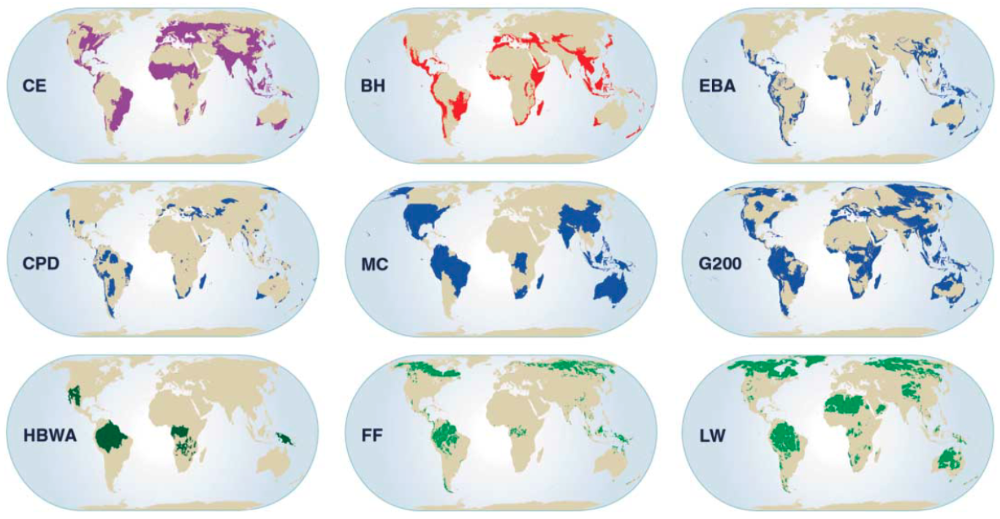
```
.footnote[Comparison of 9 approaches for global biodiversity conservation prioritization - [Brooks et al. 2006](http://dx.doi.org/10.1126/science.1127609)]

---

## Where or how much do we need to protect? 

e.g. [**Global Biodiversity Hotspots**](https://www.conservation.org/priorities/biodiversity-hotspots) - areas "that are both biologically ***rich*** and deeply ***threatened***"

```{r echo = F, fig.align = 'center', out.width = '60%'}
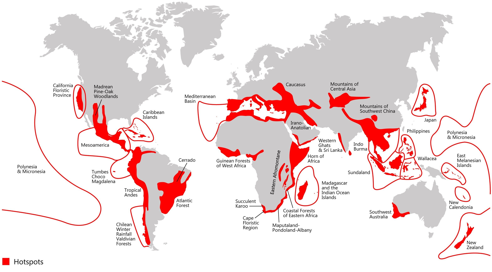
```

Most schemes prioritise ***irreplaceability*** (e.g. species endemism) and consider ***vulnerability*** either ***reactively*** (prioritising areas under threat) or ***proactively*** (prioritising areas with less threat) - [Brooks et al. 2006](http://dx.doi.org/10.1126/science.1127609).

---

## Where or how much do we need to protect? 

Most ***global*** conservation priorities link to specific NGOs or funders to guide where to invest their effort.

```{r echo = F, fig.align = 'center', out.width = '70%'}

```
.footnote[Comparison of 9 approaches for global biodiversity conservation prioritization - [Brooks et al. 2006](http://dx.doi.org/10.1126/science.1127609)]

---

## Where or how much do we need to protect? 

International treaties like the GBF are concerned with conserving biodiversity globally, but also track progress towards targets and commitments at the national scale. They require signatory countries to have instruments like a [**National Biodiversity Strategy and Action Plan**](https://www.dffe.gov.za/national-biodiversity-strategy-and-action-plan) to outline how they intend to deliver on their commitments.

```{r echo = F, fig.align = 'center', out.width = '65%'}
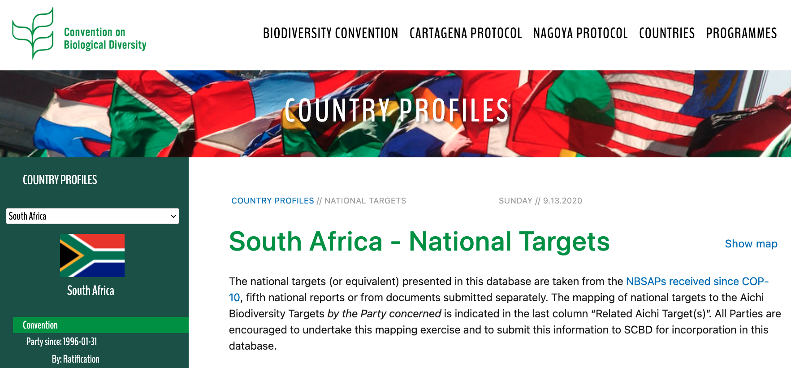
```
.footnote[https://www.cbd.int/countries/targets/?country=za - Also see [country report on Aichi target 11](https://www.cbd.int/pa/doc/dossiers/south-africa-abt11-country-dossier2021.pdf) as an example.]

---

class: center, middle

## Where or how much do we need to protect? 

> While ***global*** conservation priorities guide investment, ***local*** scale planning is necessary for implementation.


---

## Global vs Local conservation priorities?

.pull-left[
### Global

- Require datasets with global coverage
  - Often trades off with data quality/resolution and/or taxonomic groups included
  - Typically based on bioregional classification and specialist opinion
- Analyst lacks local knowledge of all areas and/or access to experts for input
- Data, computation power and other constraints typically limit analyses to coarse spatial grain (countries, degree grid squares, etc)
- Cannot consider local nuance
]

.pull-right[
### Local

- Can include patchy local data
  - Allows including higher quality data and usually more taxonomic groups
  - Usually based on primary biodiversity data and aware of their flaws/assumptions
- Analyst typically has good local knowledge and/or access to experts for input
- Analyses can be done at very fine spatial grains if the data and computation allow (10s to 100s of metres)
- Can account for local nuance
  - biodiversity, resources, institutions, policy, trade-offs
]

---

## Local conservation priorities and planning

.pull-left[
Historically, many conservation areas are focused on either a target **species** or a broader community or **ecosystem** 

  - e.g. Bontebok National Park vs [Nieuwoudtville Wild Flower Reserve](https://www.nieuwoudtville.com/flower-routes/) vs the [Cape Floral Region Protected Areas UNESCO World Heritage Site](https://whc.unesco.org/en/list/1007/)

I'm not going to dwell on this, but it'll come up repeatedly. Ultimately both usually require protected areas. It's usually more about how they are managed.

  - e.g. Bontebok National Park used to be burnt very frequently and areas were even fertilized to encourage forage for the Bontebok, often to the detriment of the flora in the Park

]

.pull-right[
```{r echo = F, fig.align = 'center', out.width = '100%'}
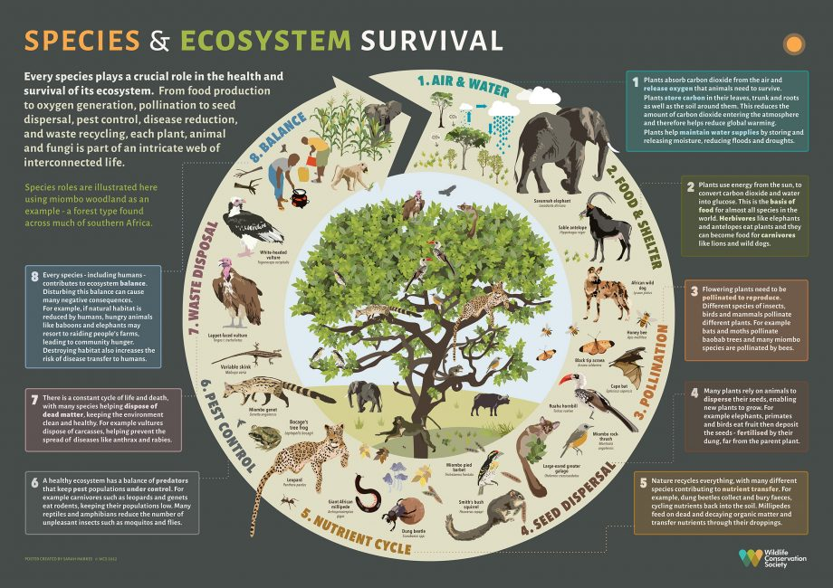
```

.footnote[Image from the [Wildlife Conservation Society](https://blog.wcs.org/photo/2022/10/31/understanding-species-roles-in-ecosystem-survival-tanzania/)]
]


---

## Local conservation priorities and planning

.pull-left[

In modern conservation planning, we typically already have some **historical protected area network** or similar and the goals are to improve on existing conservation efforts.

Unfortunately, the existing networks usually contain a **biased sample** of biodiversity, usually focused on charismatic species or remote places and other areas that are unsuitable for commercial activities.
  - e.g. Kruger National Park was established in area that was plagued by tsetse fly

]

.pull-right[

```{r echo = F, fig.align = 'center', out.width = '100%'}

```

> _"A more systematic approach to locating and designing reserves [...] will need to be implemented if a large proportion of today’s biodiversity is to exist in [...] future..."_ - [Margules and Pressey 2000](http://dx.doi.org/10.1038/35012251)

This is called ***Systematic Conservation Planning***.

]

---

## Systematic Conservation Planning

#### Steps* according to [Margules and Pressey 2000](http://dx.doi.org/10.1038/35012251):

1. Compile data on the biodiversity of the planning region
  - map biodiversity
2. Identify conservation goals for the planning region
  - set quantitative and qualitative targets (# of species, % area, "mostly natural", etc)
3. Review existing conservation areas
  - assess extent to which they address the goals and targets
4. Select additional conservation areas
  - to achieve goals and targets, but subject to constraints on budgets, social impacts etc
5. Implement conservation actions
  - prioritise actions, acquire properties, develop management plans, etc
  - _revise plan as new issues and constraints come to light!_
6. Maintain the required values of conservation areas
  - set conservation goals for each area/reserve, implement actions, monitor and modify as needed

*There have been many elaborations since this paper - especially to do with stakeholder engagement etc.

---

## Maintain the required value of conservation areas! 

.pull-left[ 

Just because it's in a "protected area" does not necessarily mean it is no longer under threat!

There are different kinds (or levels) and the definition of protected areas (and "conservation"!) differs between regions, as do resources and willingness to implement conservation actions, etc.

"Paper parks" are a common phenomenon - protected areas on paper, but not in practice...

Putting an area aside for biodiversity is not a silver bullet! The effectiveness of the protected area is key - requiring appropriate management, financing, public support, etc

This is usually more than half the battle!

]

.pull-right[
```{r echo = F, fig.align = 'left', out.width = '100%'}
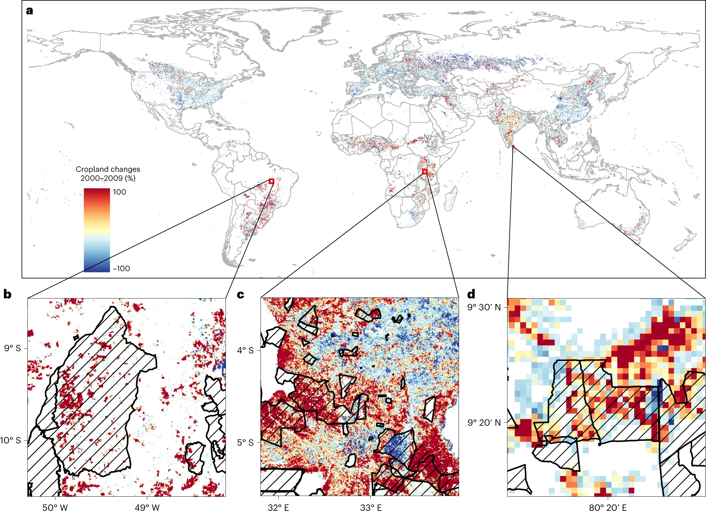
```

There has been drastic cropland expansion over the past 2 decades in many protected areas of the world - [Meng et al. 2023](http://dx.doi.org/10.1038/s41893-023-01093-w).

]

---

class: middle

## Take-home

>*Area-based conservation is the primary means of reducing habitat loss and degradation*
>   - *The underlying premise being that more area will protect more species*
>   - *The core of global agreements under the UN Convention on Biological Diversity (_The 2010 Biodiversity Target, The Aichi Targets, The Global Biodiversity Framework_) is expansion of areas under protection*

>*Unfortunately, we can't put all areas (and thus all biodiversity) under area-based conservation, so...* 

>   - *We have to balance trade-offs with other human needs and rights*
>   - *We have to have transparent and defensible ways of deciding what to protect, where, and how much*
>   - *We need to ensure that the protection we do implement is effective and sustainable*

>*How we address the issues above often differs depending on whether we are looking to do "top-down" prioritisation of conservation actions at the Global scale versus "bottom-up" conservation planning at Local scales (and everything in between)*

>   - *Systematic Conservation Planning aims to address these issues in a transparent framework, and is usually applied at country down to landscape scales.*

---
class: center, middle

# Thanks!

Slides created via the R packages:

[**xaringan**](https://github.com/yihui/xaringan)<br>
[gadenbuie/xaringanthemer](https://github.com/gadenbuie/xaringanthemer)

The chakra comes from [remark.js](https://remarkjs.com), [**knitr**](http://yihui.name/knitr), and [R Markdown](https://rmarkdown.rstudio.com).
