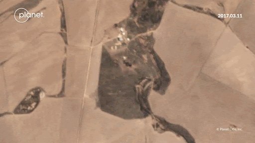
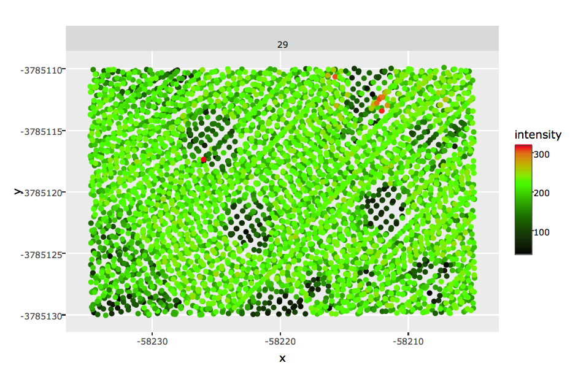
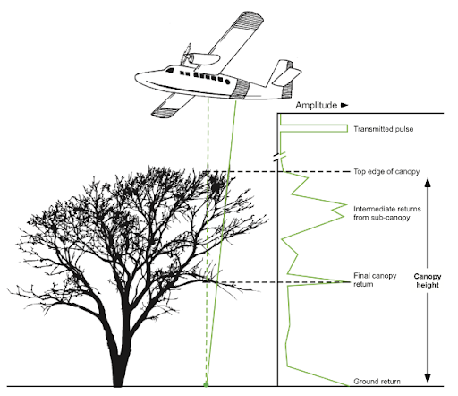
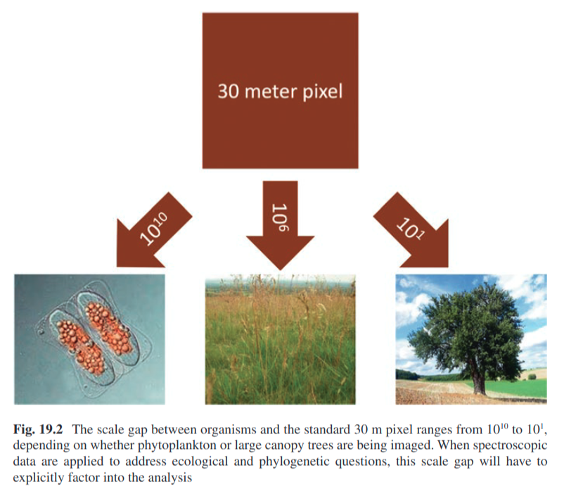
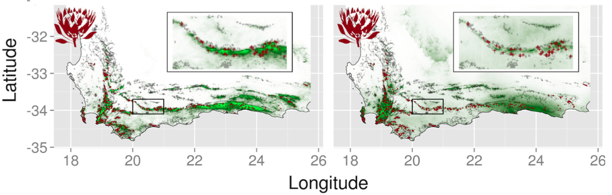
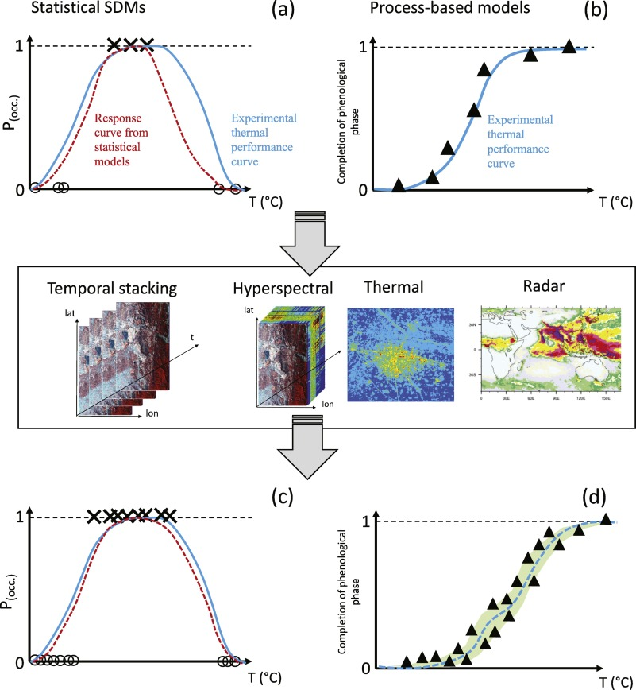
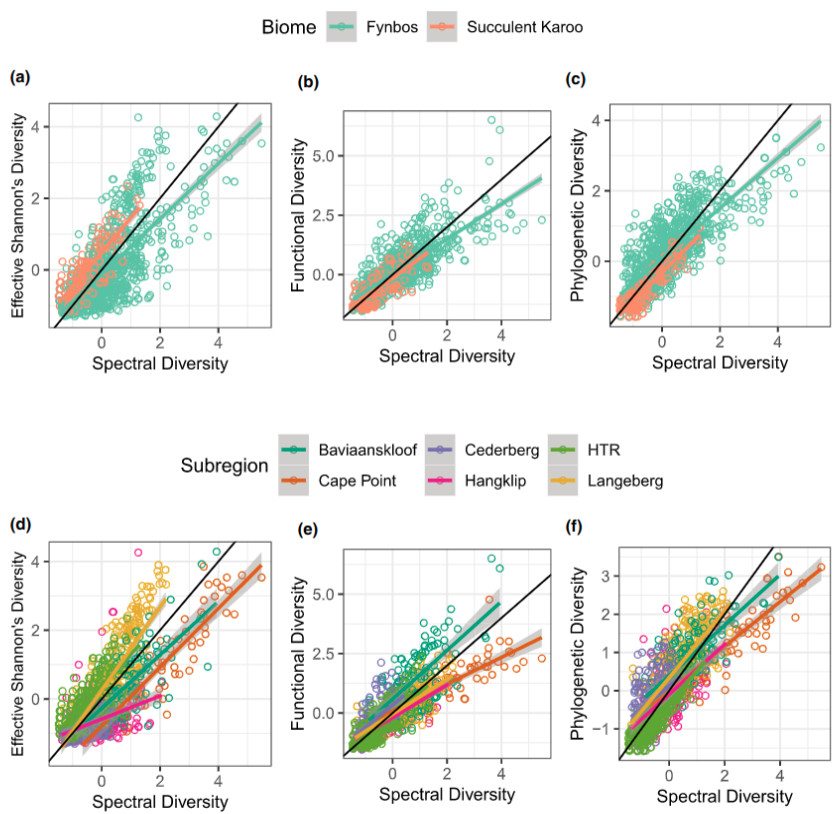
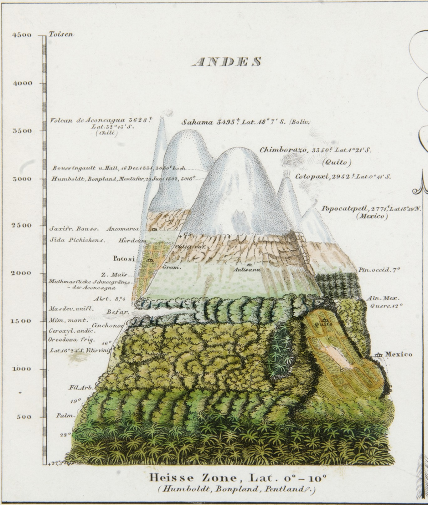

```{r setup, include=FALSE}
options(htmltools.dir.version = FALSE)
knitr::opts_chunk$set(
  fig.width=9, fig.height=3.5, fig.retina=3,
  out.width = "100%",
  cache = FALSE,
  echo = TRUE,
  message = FALSE, 
  warning = FALSE,
  hiline = TRUE
)

# library(RefManageR)
# BibOptions(check.entries = FALSE,
#            bib.style = "authoryear",
#            cite.style = "alphabetic",
#            style = "markdown",
#            hyperlink = FALSE,
#            dashed = FALSE)
# myBib <- ReadBib("bib/2_area.bib", check = FALSE)
```

```{r xaringan-themer, include=FALSE, warning=FALSE}
library(xaringanthemer)

# style_duo_accent(
#   primary_color = "#1381B0",
#   secondary_color = "#FF961C",
#   inverse_header_color = "#FFFFFF"
# )

style_mono_light(base_color = "#23395b")

#https://mycolor.space/?hex=%2323395B&sub=1 
#"Generic gradient" - #23395B #006287 #008E9D #00B897 #89DD81 #F9F871
#"Matching gradient" (reverse) - #23395B #494E77 #716292 #9C77AA #C88DBF #F5A3D0


library(knitr)
library(kableExtra)
```


```{r xaringan-tile-view, echo=FALSE}
# xaringanExtra::use_tile_view()
```

class: center

## "Protecting area"

```{r echo = F, fig.align = 'centre', out.width = '85%'}

```

Habitat loss is the biggest driver of biodiversity loss.

.footnote[Land Cover from [Hansen et al. 2022](https://doi.org/10.1088/1748-9326/ac46ec). Interactive online [***here.***](https://glad.earthengine.app/view/global-land-cover-land-use-v1)]

---
class: center

##  "Protecting area" 

```{r echo = F, fig.align = 'centre', out.width = '70%'}
knitr::include_graphics("images/protected_areas_map.png")
```

Habitat protection should be the most effective means to stem this loss.

.footnote[Global protected areas from [Bingham et al. 2019](http://dx.doi.org/10.1038/s41559-019-0869-3)]

---

layout: false

.pull-left[
## Why protect area?

#### The number of species increases with area...

**The species-area relationship** is described by the **species-area curve**, a graphical relationship in which increases in area ( $A$ ) are associated with increases in the number of species ( $S$ ). 

The curve can be described by the equation $S = cA^z$, where $c$ and $z$ are constants fitted to the data.

Taking the logarithm of both sides makes the relationship linear $log S = log C + z log A$.

The relationship holds for a wide range of ecosystems with many different types of organisms.
]

.pull-right[

```{r echo = F, fig.align = 'center', out.width = '75%'}

```

.footnote[Image: [**Wikipedia**](https://en.wikipedia.org/wiki/Species%E2%80%93area_relationship#)]

]

---

class: center

## Most agree that protecting area is a good idea...

```{r echo = F, fig.align = 'centre', out.width = '70%'}
knitr::include_graphics("images/kunming.png")
```

.footnote[The signing of the [**Global Biodiversity Framework**, Dec 2022](https://www.cbd.int/gbf/)]

---

## The [Global Biodiversity Framework](https://www.cbd.int/gbf/)

#### 4 goals for 2050 and 23 targets for 2030

The first part of Goal A:
> _"The integrity, connectivity and resilience of all ecosystems are maintained, enhanced, or restored, substantially **increasing the area** of natural ecosystems by 2050"_

Targets 1, 2 and 3 are all area-centric:
> Target 1: _"...to bring the loss of **areas** of high biodiversity importance...close to zero by 2030..."_

> Target 2: _"...by 2030 at least 30 per cent of **areas** of degraded terrestrial, inland water, and marine and coastal ecosystems are under effective restoration..."_

> Target 3: _"...by 2030 at least 30 per cent of terrestrial and inland water areas, and of marine and coastal areas... are effectively conserved and managed [in] **protected areas** and other effective area-based conservation measures..."_ 

[***Target 3 is the so-called 30x30 goal***](https://www.30x30.solutions/)

---

class: center, middle

## But there are many challenges:

We can't protect it all...

_We have to balance trade-offs with other human needs for (or rights to!) land and resources._

<br>

Where or how much do we need to protect? 

_What should we protect? How do we decide?_

<br>

What is "protection"? 

_How do we ensure it is effective?_

---

class: center

## We can't protect it all...

```{r echo = F, fig.align = 'centre', out.width = '85%'}

```

Habitat loss occurs because we need space to live, grow food, etc....

.footnote[Land Cover from [Hansen et al. 2022](https://doi.org/10.1088/1748-9326/ac46ec). Interactive online [***here.***](https://glad.earthengine.app/view/global-land-cover-land-use-v1)]

---

layout: false

.pull-left[
## Some areas are more diverse than others...

The number of species increases with area, but the species-area relationship varies depending on the **area** being sampled... 

```{r echo = F, fig.align = 'center', out.width = '70%'}
knitr::include_graphics("images/fynbos.png")
```

In fact, we often compare the diversity of different regions using species-area curves...

]

.pull-right[

```{r echo = F, fig.align = 'center', out.width = '70%'}
knitr::include_graphics("images/cowling2015.png")
```

.footnote[[Cowling et al. 2015](http://dx.doi.org/10.1111/jbi.12429) comparison of Med-Type Ecosystems.]
]

---

## Where or how much do we need to protect? 

### Some areas are more diverse than others...

```{r echo = F, fig.align = 'center', out.width = '80%'}
knitr::include_graphics("images/kreft2007_crop.jpg")
```
.footnote[Estimated global plant species richness - [Kreft & Jetz 2007](http://dx.doi.org/10.1073/pnas.0608361104), _PNAS_]

---

## Where or how much do we need to protect? 

#### There are many ways to set conservation priorities!!!

```{r echo = F, fig.align = 'center', out.width = '70%'}
knitr::include_graphics("images/brooks2006_cons_prior.png")
```
.footnote[Comparison of 9 approaches for global biodiversity conservation prioritization - [Brooks et al. 2006](http://dx.doi.org/10.1126/science.1127609)]

---

## Where or how much do we need to protect? 

e.g. [**Global Biodiversity Hotspots**](https://www.conservation.org/priorities/biodiversity-hotspots) - areas "that are both biologically ***rich*** and deeply ***threatened***"

```{r echo = F, fig.align = 'center', out.width = '60%'}
knitr::include_graphics("images/hotspots.jpg")
```

Most schemes prioritise ***irreplaceability*** (e.g. species endemism) and consider ***vulnerability*** either ***reactively*** (prioritising areas under threat) or ***proactively*** (prioritising areas with less threat) - [Brooks et al. 2006](http://dx.doi.org/10.1126/science.1127609).

---

## Where or how much do we need to protect? 

Most ***global*** conservation priorities link to specific NGOs or funders to guide where to invest their effort.

```{r echo = F, fig.align = 'center', out.width = '70%'}
knitr::include_graphics("images/brooks2006_cons_prior.png")
```
.footnote[Comparison of 9 approaches for global biodiversity conservation prioritization - [Brooks et al. 2006](http://dx.doi.org/10.1126/science.1127609)]

---

## Where or how much do we need to protect? 

International treaties like the GBF are concerned with conserving biodiversity globally, and have global targets, but also track progress towards targets and commitments at the national scale.

```{r echo = F, fig.align = 'center', out.width = '70%'}

```
.footnote[https://www.cbd.int/countries/targets/?country=za - Also see [country report on Aichi target 11](https://www.cbd.int/pa/doc/dossiers/south-africa-abt11-country-dossier2021.pdf) as an example.]

---

## Where or how much do we need to protect? 

While ***global*** conservation priorities guide investment, ***local*** scale planning is necessary to for actual implementation.


---

## Global vs Local conservation priorities?

.pull-left[
### Global

- Require datasets with global coverage
  - Often trades off with data quality/resolution and/or taxonomic groups included
  - Typically based on bioregional classification and specialist opinion
- Analyst lacks local knowledge of all areas and/or access to experts for input
- Data, computation power and other constraints typically limit analyses to course spatial grain (countries, degree grid squares, etc)
- Cannot consider local nuance
]

.pull-right[
### Local

- Can include patchy local data
  - Allows including higher quality data and usually more taxonomic groups
  - Usually based on primary biodiversity data and aware of their flaws/assumptions
- Analyst typically has good local knowledge and/or access to experts for input
- Analyses can be done at very fine spatial grains if the data and computation allow (10s to 100s of metres)
- Can account for local nuance
  - biodiversity, resources, institutions, policy, trade-offs
]

---

## Local conservation priorities and planning

.left-column[
Historically, many conservation areas are focused on either a target **species** or a broader **ecosystem** - e.g. Bontebok National Park vs the [Cape Floral Region Protected Areas UNESCO World Heritage Site](https://whc.unesco.org/en/list/1007/)

I'm not going to dwell on this, but it'll come up repeatedly. Ultimately both usually require protected areas.

]

.right-column[
```{r echo = F, fig.align = 'center', out.width = '70%'}
knitr::include_graphics("images/species-and-ecosystem.jpg")
```

.footnote[Image from the [Wildlife Conservation Society](https://blog.wcs.org/photo/2022/10/31/understanding-species-roles-in-ecosystem-survival-tanzania/)]
]


---

## Local conservation priorities and planning

.pull-left[

In modern conservation planning, we typically already have some **historical protected area network** or similar and the goals are to improve on existing conservation efforts.

Unfortunately, the existing networks usually contain a **biased sample** of biodiversity, usually focused on charismatic species or remote places and other areas that are unsuitable for commercial activities.

> _"A more systematic approach to locating and designing reserves [...] will need to be implemented if a large proportion of today’s biodiversity is to exist in [...] future..."_ - [Margules and Pressey 2000](http://dx.doi.org/10.1038/35012251)

This is called ***Systematic Conservation Planning***.

]

---

## Systematic Conservation Planning

1. Compile data on the biodiversity of the planning region
2. Identify conservation goals for the planning region
3. Review existing conservation areas
4. Select additional conservation areas
5. Implement conservation actions
6. Maintain the required values of conservation areas

.footnote[[Margules and Pressey 2000](http://dx.doi.org/10.1038/35012251)]

---

## Maintain the required value... 
### Protected area effectiveness - LULC

.pull-left[ 
There has been drastic cropland expansion over the past 2 decades in many protected areas of the world ([Meng et al. 2023](http://dx.doi.org/10.1038/s41893-023-01093-w)).

The term "paper parks" ...

.footnote[LULC = Land use and land cover change]
]

.pull-right[
```{r echo = F, fig.align = 'left', out.width = '100%'}
knitr::include_graphics("images/meng_2023_cropland.webp")
```
]

---

## End

---

Learning outcomes

- Big frameworks
    - 30 by 30, Nature needs half, etc
- The logic (species-area curves etc)
- Protected areas and 'Other effective area-based conservation measures' (OECMs)
- Difficulties, risks and trade-offs
    - How to prioritise?
    - Alternative land uses
    - Social equity
    - Protected area effectiveness 
        - Varied interpretations of protected areas and LULC within PAs
        - Management effectiveness and degradation
        - IAPs
        - Tourist impacts
        - Lack of income


---

layout: false

.pull-left[
## The number of species increases with area...

But, the species-area relationship varies depending on the **area** being sampled...

We often compare the diversity of different regions using species-area curves (usually on log-log axes so the curves are linear) - e.g. Cowling et al. 2015

```{r echo = F, fig.align = 'left', out.width = '98%'}
knitr::include_graphics("images/fynbos.png")
```

]

.pull-right[

```{r echo = F, fig.align = 'center', out.width = '75%'}
knitr::include_graphics("images/cowling2015.png")
```

]

---

## "Protecting area"

.pull-left[

### Global Land Cover

```{r echo = F, fig.align = 'centre', out.width = '100%'}

```

Habitat loss is the biggest driver of biodiversity loss.

.footnote[Global Land Cover from [Hansen et al. 2022](https://doi.org/10.1088/1748-9326/ac46ec). Interactive online [***here.***](https://glad.earthengine.app/view/global-land-cover-land-use-v1)]

]

.pull-right[

### Global Protected Areas

```{r echo = F, fig.align = 'centre', out.width = '80%'}
knitr::include_graphics("images/protected_areas_map.png")
```

Habitat protection should be the most effective means to stem this loss.

.footnote[from [Bingham et al. 2019](http://dx.doi.org/10.1038/s41559-019-0869-3)]
]
---

## Protected area effectiveness - LULC

.pull-left[ 
There has been drastic cropland expansion over the past 2 decades in many protected areas of the world ([Meng et al. 2023](http://dx.doi.org/10.1038/s41893-023-01093-w)).

The term "paper parks" ...

.footnote[LULC = Land use and land cover change]
]

.pull-right[
```{r echo = F, fig.align = 'left', out.width = '100%'}
knitr::include_graphics("images/meng_2023_cropland.webp")
```
]

---

## Protected area effectiveness - LULC

.left-column[ 
.footnote[LULC = Land use and land cover change]
]
.right-column[
```{r echo = F, fig.align = 'left', out.width = '70%'}
knitr::include_graphics("images/meng_2023_cropland.webp")
```
]
---

class: center, middle

background-color: black

text-color: white

```{r echo = F, fig.align = 'center', out.width = '50%'}
knitr::include_graphics("images/blue_marble.jpg")
```

---

.pull-left[
## "The Blue Marble"

```{r echo = F, fig.align = 'left', out.width = '90%'}
knitr::include_graphics("images/blue_marble.jpg")
```
]

.pull_right[

<br>

- Taken from the Apollo 17 mission in 1972

- Highlights Earth as a single global system 

]

---

class: center, middle

### We want to measure biodiversity everywhere, all the time...

```{r echo = F, fig.align = 'center', out.width = '80%'}
knitr::include_graphics("images/world_seasonality.gif")
```

.center[Remote sensing is pretty much the only way this can be achieved...]

---

layout: false

.pull-left[

## It's a rapidly growing field

```{r echo = F, fig.align = 'left', out.width = '90%'}
knitr::include_graphics("images/turner2003.png")
```

```{r echo = F, fig.align = 'left', out.width = '90%'}
knitr::include_graphics("images/satellitelaunches.jpg")
```

.footnote[Turner et al. 2003]
]

.pull-right[

```{r echo = F, fig.align = 'left', out.width = '75%'}
knitr::include_graphics("images/cavenderbares2020.png")
```
.footnote[Cavender-Bares et al. 2020]

]

---

class: center

```{r echo = F, fig.align = 'center', out.width = '100%'}
knitr::include_graphics("images/bioscape.png")
```
.left[.footnote[...and the Cape is about to be the epicentre of this endeavour - https://www.bioscape.io/]]

---

layout: false

## BioSCape: Biodiversity Survey of the Cape

.pull-left[

- $>$ 100 scientists and conservation practitioners
- 16 teams (mixed US, RSA, other)
- terrestrial and aquatic
- 2 planes
- 4 instruments (hyperspectral and LiDAR)
- fundamental and applied science

```{r echo = F, fig.align = 'center', out.width = '100%'}
knitr::include_graphics("images/bioscape_planes.png")
```

]

.pull-right[
```{r echo = F, fig.align = 'center', out.width = '100%'}
knitr::include_graphics("images/bioscape_kumu.png")
```
.footnote[www.bioscape.io]
]

---

class: center, middle

## But how do we actually measure biodiversity with remote sensing?

---

layout: false

.pull-left[
## There are many facets of biodiversity to measure!

<br>

An advantage of remote sensing is that it can directly measure the structure, composition and function of biodiversity... 

...at least from the scale of individuals up...

]

.pull-right[
```{r echo = F, fig.align = 'center', out.width = '100%'}
knitr::include_graphics("images/Noss_Biodiversity.png")
```
.footnote[Noss 1990, _Conservation Biology_]
]

---

layout: false

.pull-left[
## There are many facets of biodiversity to measure!

An advantage of remote sensing is that it can directly measure the structure, composition and function of biodiversity... 


```{r echo = F, fig.align = 'center', out.width = '120%'}
knitr::include_graphics("images/skidmore2021_fig1.png")
```
.footnote[Skidmore et al. 2021]

]

.pull-right[

```{r echo = F, fig.align = 'center', out.width = '90%'}
knitr::include_graphics("images/ebv_circle.png")
```


...at least from the scale of individuals up...

.footnote[https://geobon.org/]

]

---

class: center

##Productivity and Seasonality

```{r echo = F, fig.align = 'center', out.width = '80%'}
knitr::include_graphics("images/world_seasonality.gif")
```

---

class: center

##Land cover (and change)

```{r echo = F, fig.align = 'center', out.width = '50%'}
knitr::include_graphics("images/skowno2021.jpg")
```

.left[.footnote[Skowno et al. 2021]]

---

class: center

##Land cover change detection

```{r echo = F, fig.align = 'center', out.width = '70%'}

```

.left[.footnote[Moncrieff 2022]]

---

class: center

##Land cover change time series

```{r echo = F, fig.align = 'center', out.width = '60%'}
knitr::include_graphics("images/moilwe.png")
```

.left[.footnote[Moilwe et al. in prep]]

---

class: center, middle

## But what about metrics like species, functional and phylogenetic diversity?

---

layout: false

.pull-left[
## Functional diversity?

```{r echo = F, fig.align = 'center', out.width = '100%'}

```

Proteaceae shrubs (dark green) surrounded by low shrubs, forbs and graminoids at Silvermine, TMNP. 

.footnote[Data from City of Cape Town]

]

.pull-right[
```{r echo = F, fig.align = 'center', out.width = '100%'}

```

Light detection and ranging (LiDAR) allows you to measure topography and the vertical structure of vegetation.

.footnote[Purkis and Klemas 2011]
]

---

layout: false

.pull-left[
## Functional diversity?

Imaging spectroscopy ("hyperspectral" remote sensing) allows direct measurement of leaf traits.

```{r echo = F, fig.align = 'left', out.width = '92%'}
knitr::include_graphics("images/cawse2021_spectra.png")
```

]

.pull-right[
```{r echo = F, fig.align = 'center', out.width = '100%'}
knitr::include_graphics("images/peninsula_hyperspec.png")
```
]

---

layout: false

## Phylogenetic diversity?

```{r echo = F, fig.align = 'center', out.width = '70%'}
knitr::include_graphics("images/meireles2020.jpg")
```

.left[.footnote[Meireles et al. 2020]]

Leaf spectra are phylogenetically conserved for some regions, so it's possible that we'll be able to discern lineages using imaging spectroscopy...

---

layout: false

.pull-left[
## Identifying species?

We can monitor populations of large species..., but identifying all species present...?

```{r echo = F, fig.align = 'center', out.width = '70%'}
knitr::include_graphics("images/machine_learning.png")
```

.footnote[https://xkcd.com/1838/]
]

.pull-right[
```{r echo = F, fig.align = 'center', out.width = '75%'}
knitr::include_graphics("images/cedars_pic.png")
knitr::include_graphics("images/cedars_mapped.png")
```

.footnote[Hadebe 2021 MSc thesis]
]

---

class: center

##There are challenges and limitations...

```{r echo = F, fig.align = 'center', out.width = '50%'}

```

.left[.footnote[Schimel et al. 2020]]

---

class: center

##But this is what fancy modelling and proxies are for...

```{r echo = F, fig.align = 'center', out.width = '43%'}
knitr::include_graphics("images/jetz2016.png")
```

.left[.footnote[Jetz et al. 2016]]

---

layout: false

.pull-left[
## Combining remote sensing and in situ data

Using remotely sensed environmental data to inform species distribution models

```{r echo = F, fig.align = 'center', out.width = '100%'}

```

E.g. Observed cloud frequency from the MODIS satellite is a better predictor of the distribution of _Protea cynaroides_ than interpolated precipitation.

.footnote[Wilson and Jetz 2016]

]

.pull-right[
```{r echo = F, fig.align = 'center', out.width = '100%'}

```
.footnote[Randin et al. 2020]
]

---

layout: false

.pull-left[
## The Spectral Diversity Hypothesis

Is spectral diversity a good proxy for biotic diversity?

```{r echo = F, fig.align = 'left', out.width = '100%'}
knitr::include_graphics("images/frye2021map.png")
```

]

.pull-right[
```{r echo = F, fig.align = 'center', out.width = '90%'}

```

A test looking at spectral diversity from leaf spectra for 1210 species across 1267 plots supports the hypothesis **at the leaf level...**

.footnote[Frye et al. 2021]
]

---

layout: false

.pull-left[
## The Spectral Diversity Hypothesis


```{r echo = F, fig.align = 'left', out.width = '85%'}
knitr::include_graphics("images/vanleeuwen2020_scale.png")
```

]

.pull-right[
```{r echo = F, fig.align = 'center', out.width = '70%'}

```

But canopy reflectance is more complex...

Leaf angle, shadow, density, etc affect the spectral reflectance of vegetation, reducing our ability to identify and map species - especially as the resolution of the imagery coarsens.

.footnote[van Leeuwen et al. 2021]
]

---

layout: false

.pull-left[
### Environmental heterogeneity

Another approach is just to map and monitor environmental heterogeneity

####_"Conserving nature's stage"_

The Nature Conservancy and others using this approach to identify parcels of Earth that are valuable for their capacity to support diverse life forms today and into the future

Typically identified based on their abiotic heterogeneity or geodiversity, much of which can be mapped and/or monitored with remote sensing - topography, climate, soils, etc

]

.pull-right[
```{r echo = F, fig.align = 'center', out.width = '90%'}

```
.footnote[Alexander von Humboldt]
]

---
class: middle

## Take-home

>*There are many ways to measure biodiversity. None are perfect. You should treat them as hypotheses.*

>*How you measure biodiversity can affect the outcome of your study. There are many ways to measure biodiversity incorrectly for the application at hand!*

>*Measures of biodiversity allow us to explore:*
> - *How biodiversity is generated and communities are assembled*
> - *How biodiversity affects ecosystem functions, including benefits to society*
> - *How the environment is changing with time and human impacts*

>*Community assembly, biotic effects on ecosystem function, and responses to global change are tightly intertwined*

---

## References

```{r refs, echo=FALSE, results="asis"}
#NoCite(myBib)
#PrintBibliography(myBib)
```

---
class: center, middle

# Thanks!

Slides created via the R packages:

[**xaringan**](https://github.com/yihui/xaringan)<br>
[gadenbuie/xaringanthemer](https://github.com/gadenbuie/xaringanthemer)

The chakra comes from [remark.js](https://remarkjs.com), [**knitr**](http://yihui.name/knitr), and [R Markdown](https://rmarkdown.rstudio.com).
