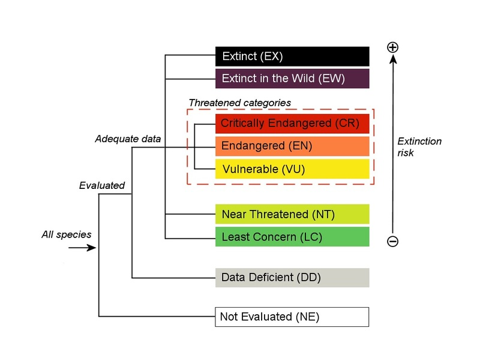
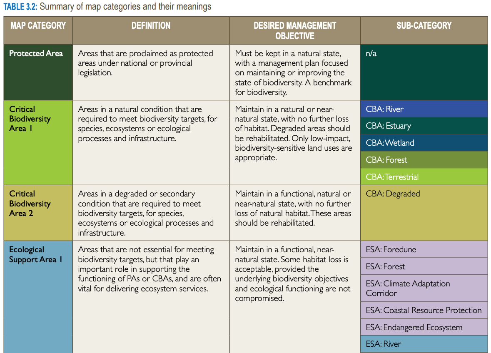

```{r setup, include=FALSE}
options(htmltools.dir.version = FALSE)
knitr::opts_chunk$set(
  fig.width=9, fig.height=3.5, fig.retina=3,
  out.width = "100%",
  cache = FALSE,
  echo = TRUE,
  message = FALSE, 
  warning = FALSE,
  hiline = TRUE
)

library(RefManageR)
BibOptions(check.entries = FALSE,
           bib.style = "authoryear",
           cite.style = "alphabetic",
           style = "markdown",
           hyperlink = FALSE,
           dashed = FALSE)
myBib <- ReadBib("bib/2_species.bib", check = FALSE)
```

```{r xaringan-themer, include=FALSE, warning=FALSE}
library(xaringanthemer)

# style_duo_accent(
#   primary_color = "#1381B0",
#   secondary_color = "#FF961C",
#   inverse_header_color = "#FFFFFF"
# )

style_mono_light(base_color = "#23395b")

#https://mycolor.space/?hex=%2323395B&sub=1 
#"Generic gradient" - #23395B #006287 #008E9D #00B897 #89DD81 #F9F871
#"Matching gradient" (reverse) - #23395B #494E77 #716292 #9C77AA #C88DBF #F5A3D0


library(knitr)
library(kableExtra)
```


```{r xaringan-tile-view, echo=FALSE}
# xaringanExtra::use_tile_view()
```

class: center, middle

## WARNING!!!

This lecture is a bit of a mash-up of different topics. My aim is to give you some idea of species and ecosystem threat assessments and some idea of how they are applied globally and in South Africa, to give you local context. Be aware that I am glossing over a lot of important detail to squeeze it into one lecture. There are things I have missed and potentially even misrepresented in order to simplify...

---

class: center, middle

```{r echo = F, fig.align = 'center', out.width = '70%'}
knitr::include_graphics("images/conservation_history_dffe.png")
```

.footnote[[from DFFE website "South African History of conservation"](https://www.dffe.gov.za/projectsprogrammes/peopleparks/southafrican_conservationhistory)]

---

.pull-left[

## History of Conservation

We don't have a good record to be honest...

In reality, we know many civilizations controlled access to resources like hunting, timber and the like. 

  - There is good record from pre-colonial South Africa, but it more than likely extends back thousands of years in many parts of the world.

The common denominator is sparing a resource. All that has really changed (or is changing) is the focal resource, how we view and quantify it, and who and what we are sparing it for (i.e. the _priorities_).

  - Note that these "priorities" are constantly in flux and vary between cultures, countries, reserves, etc. This can cause conflict, but global treaties aim at coming to some degree of agreement.
]

.pull-right[
```{r echo = F, fig.align = 'center', out.width = '60%'}

```

Wikipedia will point you to John Evelyn's work (1662, 1664) on forests and timber production, but that's just the written record (in English at least...).

]

---

class: center, middle

## What should we be prioritising?

---

layout: false

.pull-left[
## What should we be prioritising?

<br>

### There are many facets of biodiversity!

<br>

### Where to start?

]

.pull-right[
```{r echo = F, fig.align = 'center', out.width = '100%'}
knitr::include_graphics("images/Noss_Biodiversity.png")
```
.footnote[Noss 1990, _Conservation Biology_]
]

---

class: center

.center[**Trees/forests for carbon and "climate restoration"? But at what cost for biodiversity and other resources?**]

<iframe src="https://bastinjf-climate.users.earthengine.app/view/potential-tree-cover" height="75%" width="75%" frameborder="0"></iframe>

.footnote[[_The global tree restoration potential_ (Bastin et al. 2019)](https://doi.org/10.1126/science.aax0848)]

---

class: center, middle

## What should we be prioritising?

_"To keep every cog and wheel is the first precaution of intelligent tinkering."_ - Aldo Leopold

---

class: center

#### A selected history of the International Union for Conservation of Nature (IUCN) - see [online](https://www.iucn.org/about-iucn/history)

<iframe src="https://cdn.knightlab.com/libs/timeline3/latest/embed/index.html?source=1IRSKOBSbdtWr8Gq88VO9YDj73-M9rucPIVf7vrFis7s&font=Default&lang=en&initial_zoom=2" height="85%" width="100%" frameborder="0"></iframe>

---

## A couple of key IUCN contributions (among many)

.pull-left[
- 1956 Species Survival Commission
    - 1964 The IUCN Red List of Threatened Species

- 1996 Commission on Ecosystem Management
    - 2014 IUCN Red List of Ecosystems
    
    
```{r echo = F, fig.align = 'center', out.width = '70%'}

```

]

.pull-right[

```{r echo = F, fig.align = 'center', out.width = '93%'}

```

]

---

## The IUCN Red List of Threatened Species

.pull-left[

Bins species into a set of categories representing threat of extinction based on five criteria...

```{r echo = F, fig.align = 'center', out.width = '100%'}

```

]

.pull-right[

```{r echo = F, fig.align = 'center', out.width = '97%'}

```

]

Includes detailed classification of threats to species - habitat loss, exploitation, climate change, etc

.footnote[https://www.iucnredlist.org/]


---

## The IUCN Red List of Threatened Species - Criterion A

```{r echo = F, fig.align = 'center', out.width = '100%'}

```

---

## The IUCN Red List - EOO & AOO

```{r echo = F, fig.align = 'center', out.width = '60%'}

```

---

## The IUCN Red List of Threatened Species - Criterion B

```{r echo = F, fig.align = 'center', out.width = '100%'}
knitr::include_graphics("images/rls_B.png")
```

---

## The IUCN Red List of Threatened Species - Criterion C

```{r echo = F, fig.align = 'center', out.width = '100%'}

```

---

## The IUCN Red List of Threatened Species - Criteria D&E

```{r echo = F, fig.align = 'center', out.width = '100%'}

```

---

.pull-left[

## The IUCN Red List of Threatened Species

A somewhat complex governance process that you don't need to know for the exams...
 
]

.pull-right[

```{r echo = F, fig.align = 'center', out.width = '80%'}

```

]
---

class: center, middle

## The IUCN Red List of Threatened Species

### >28% of all threatened plants are from Sub-Saharan Africa!!! 
### (7195 of 25082)

---

class: center

## BUT!

```{r echo = F, fig.align = 'center', out.width = '70%'}

```

The first complete assessment of an entire flora...

2577 (13%) of South Africa’s plant taxa are threatened with extinction

A further 2232 (11%) are listed under other categories of conservation concern

.footnote[[Raimondo 2010](http://dx.doi.org/10.4102/sajs.v107i3/4.653)]

---

## The IUCN Red List of Threatened Species - ***Incomplete!***

.pull-left[

Just over 150 000 species have been assessed to date (in ±60 years). ~62 000 are plants.

```{r echo = F, fig.align = 'center', out.width = '100%'}

```

Only a few groups have near-complete coverage (pictured above)...

.footnote[https://www.iucnredlist.org/]

]

.pull-right[

This is a huge achievement, but...

```{r echo = F, fig.align = 'center', out.width = '100%'}

```

There are an estimated 8 million species!!! Many yet to be described!

.footnote[[Gaston 2010](https://conbio.org/images/content_publications/ConservationBiologyforAll_reducedsize.pdf)]

]

---

class: center

## Beyond taxonomy, there're other data issues...

```{r echo = F, fig.align = 'center', out.width = '85%'}

```

.footnote[Species records in the [Global Biodiversity Information Facility](https://gbif.org)]

---

.pull-left[

## The IUCN Red List of Threatened Species - ***Still useful!***

Especially for taxonomic groups that are mostly complete, e.g. mammals, birds and amphibians...

<br>

These can be used in interesting ways, because we have data on the threats faced by the species, e.g.

- [Harfoot et al. 2021](http://dx.doi.org/10.1038/s41559-021-01542-9) _Using the IUCN Red List to map threats to terrestrial vertebrates at global scale_

Many ways in which patchy data can still be useful!

]

.pull-right[

```{r echo = F, fig.align = 'center', out.width = '100%'}

```

.footnote[]

]

---

.pull-left[

## Another approach...

The IUCN Red List of Ecosystems (RLE) takes an _ecosystem-based_ approach, assessing the threat of ecosystem collapse...

```{r echo = F, fig.align = 'center', out.width = '94%'}

```

]

.pull-right[
```{r echo = F, fig.align = 'center', out.width = '100%'}

```

.footnote[https://iucnrle.org/]

]

---

## The IUCN Red List of Ecosystems

.pull-left[
Requires an ecosystem typology - which SA has...

```{r echo = F, fig.align = 'center', out.width = '100%'}

```

.footnote[[Skowno et al. 2019](http://hdl.handle.net/20.500.12143/6362)]
]

.pull-right[

Based on similar criteria to the Red List of Species

```{r echo = F, fig.align = 'center', out.width = '100%'}

```

.footnote[[Bland et al. 2017](https://doi.org/10.2305/IUCN.CH.2016.RLE.3.en), [Keith et al. 2024](https://doi.org/10.2305/cjdf9122)]
]

---

class: center

## Basic workflow for RLE criteria A-C

```{r echo = F, fig.align = 'center', out.width = '75%'}

```

---

class: center

## Not all ecosystems have been assessed either...

```{r echo = F, fig.align = 'center', out.width = '80%'}

```

.footnote[https://assessments.iucnrle.org/]

---

class: center

## In fact, not all ecosystems have been defined!

```{r echo = F, fig.align = 'center', out.width = '65%'}

```

...but attempts are being made - https://global-ecosystems.org/

---

## South Africa has assessed all ecosystems and most taxa!

.pull-left[

SA plant (and other) taxa of conservation concern

```{r echo = F, fig.align = 'center', out.width = '100%'}
knitr::include_graphics("images/redlist_map.png")
```

.footnote[[Red List of South African Plants](http://redlist.sanbi.org/stats.php)]

]

.pull-right[

South Africa’s Red List of Terrestrial Ecosystems (RLEs)

```{r echo = F, fig.align = 'center', out.width = '100%'}
knitr::include_graphics("images/rle_SA_Skowno2021.webp")
```

.footnote[[Skowno and Monyeki 2021](http://dx.doi.org/10.3390/land10101048)]
]

---

class: center

## We use these threat assessments in a range of ways

```{r echo = F, fig.align = 'center', out.width = '60%'}

```

e.g. as targets for our protected area expansion strategy ([NPAES 2018](https://www.dffe.gov.za/sites/default/files/docs/national_protectedareas_expansionstrategy2018ofsouthafrica.pdf))

---

class: center

## We use these threat assessments in a range of ways

```{r echo = F, fig.align = 'center', out.width = '80%'}

```

Threatened ecosystems are afforded (some) protection under law ([NEM:BA (Biodiversity Act) 2004](https://cer.org.za/virtual-library/legislation/national/biodiversity-and-conservation/national-environmental-management-biodiversity-act-2004))

---

## We also use other criteria not presented thus far...

.pull-left[

```{r echo = F, fig.align = 'center', out.width = '100%'}

```

]

.pull-right[

```{r echo = F, fig.align = 'center', out.width = '100%'}

```

The _targets_ are things like percentage representation of all ecosystems

]

.footnote[[Western Cape Biodiversity Spatial Plan 2017](https://www.capenature.co.za/uploads/files/protected-area-management-plans/SANBI_WCBSP-Handbook.pdf)]

---

## There are also other criteria for priorities in the making...

.pull-left[

```{r echo = F, fig.align = 'center', out.width = '100%'}

```

There is increasing focus on nature-based solutions to the climate crisis...

]

.pull-right[

```{r echo = F, fig.align = 'center', out.width = '100%'}

```

[Brum et al. 2017](https://doi.org/10.1073/pnas.1706461114) propose considering threats to functional and phylogenetic diversity

]

---

class: middle

## Take-home

>*The conservation of resources is likely as old as cooperation among humans.*

>*There are many facets of biodiversity and ways to measure them that could be used as conservation priorities.*
> - *It's important to think about the potential negative impacts of any one measure or priority*

>*Modern conservation of biodiversity is largely focused on trying to avoid losing anything. Other criteria come into conservation planning, but species and ecosystem threat assessments are high up there.*

>*The IUCN have developed globally accepted guidelines for species and ecosystem threat assessments.*
> - *Unfortunately, not all species and ecosystems on the planet have been assessed...*

>*South Africa has assessed all ecosystems and most species for a number of taxonomic groups (plants, amphibians, fish, etc) and we use this for a number of purposes*
> - *Systematic Conservation Planning - e.g. Protected area expansion strategies*
> - *Our ecosystems are afforded protection under law, even outside reserves*

---
class: center, middle

# Thanks!

Slides created via the R packages:

[**xaringan**](https://github.com/yihui/xaringan)<br>
[gadenbuie/xaringanthemer](https://github.com/gadenbuie/xaringanthemer)

The chakra comes from [remark.js](https://remarkjs.com), [**knitr**](http://yihui.name/knitr), and [R Markdown](https://rmarkdown.rstudio.com).
