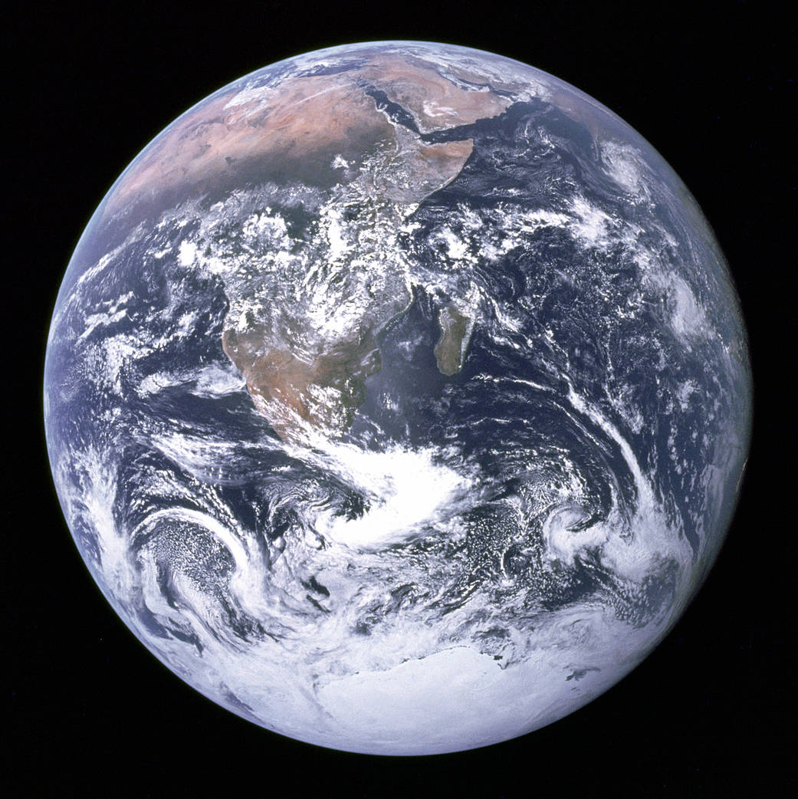
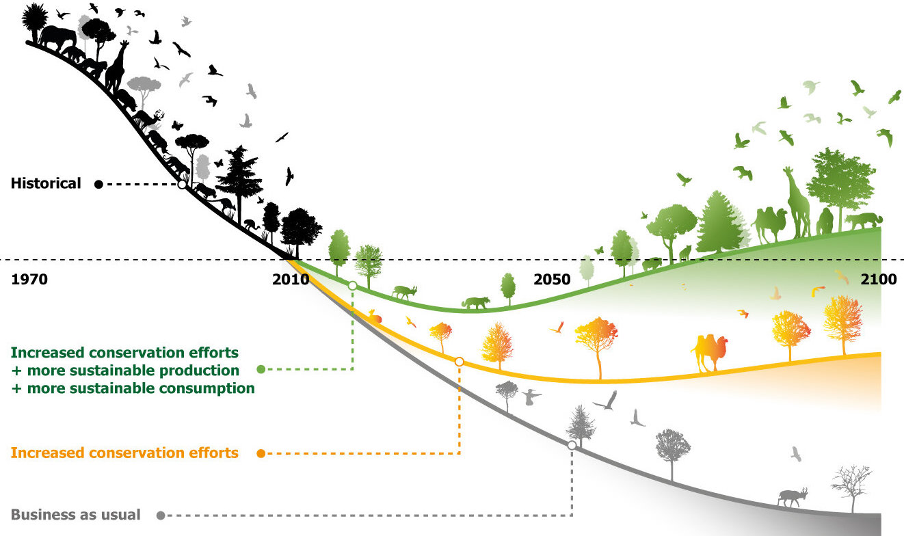
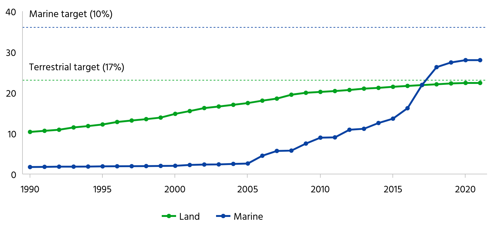
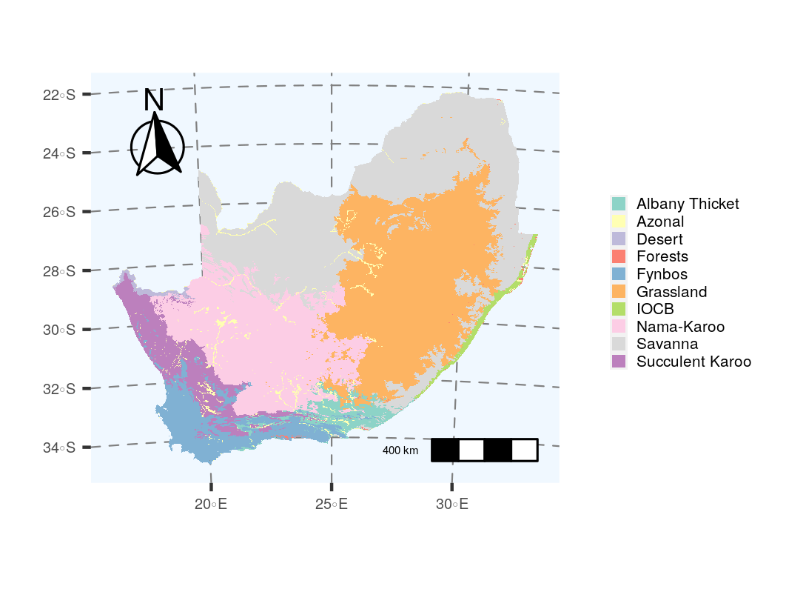
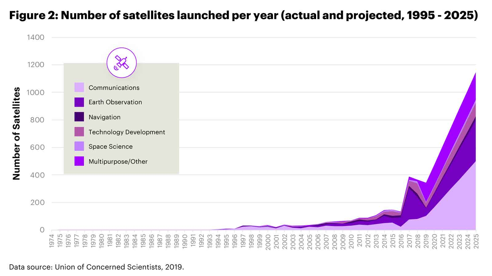
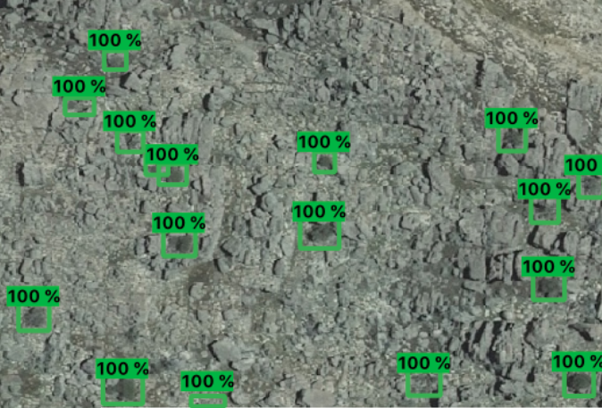
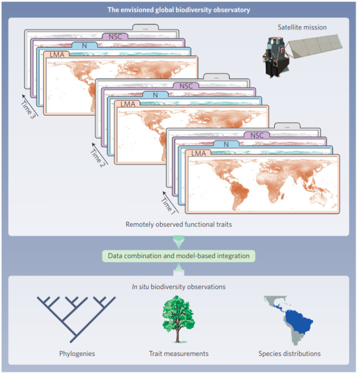

```{r setup, include=FALSE}
options(htmltools.dir.version = FALSE)
knitr::opts_chunk$set(
  fig.width=9, fig.height=3.5, fig.retina=3,
  out.width = "100%",
  cache = FALSE,
  echo = TRUE,
  message = FALSE, 
  warning = FALSE,
  hiline = TRUE
)

library(RefManageR)
BibOptions(check.entries = FALSE,
           bib.style = "authoryear",
           cite.style = "alphabetic",
           style = "markdown",
           hyperlink = FALSE,
           dashed = FALSE)
myBib <- ReadBib("bib/2_species.bib", check = FALSE)
```

```{r xaringan-themer, include=FALSE, warning=FALSE}
library(xaringanthemer)

# style_duo_accent(
#   primary_color = "#1381B0",
#   secondary_color = "#FF961C",
#   inverse_header_color = "#FFFFFF"
# )

style_mono_light(base_color = "#23395b")

#https://mycolor.space/?hex=%2323395B&sub=1 
#"Generic gradient" - #23395B #006287 #008E9D #00B897 #89DD81 #F9F871
#"Matching gradient" (reverse) - #23395B #494E77 #716292 #9C77AA #C88DBF #F5A3D0


library(knitr)
library(kableExtra)
```


```{r xaringan-tile-view, echo=FALSE}
# xaringanExtra::use_tile_view()
```

class: center, middle

## WARNING!!!

This lecture is a bit of a mash-up of different topics. My aim is to give you some idea of systematic conservation planning, species and ecosystem threat assessments and some idea of how they are applied in South Africa to give you local context. Be aware that I am glossing over a lot of important detail to squeeze it into one lecture. Note that it is also a crude (and partial!) summary by someone who has not been central to this endeavor, so there are things I have missed and potentially even misrepresented...

---

class: center, middle

```{r echo = F, fig.align = 'center', out.width = '70%'}

```

.footnote[[from DFFE website "South African History of conservation"](https://www.dffe.gov.za/projectsprogrammes/peopleparks/southafrican_conservationhistory)]

---

.pull-left[

## History of Conservation

We don't have a good record to be honest...

In reality, we know many civilizations controlled access to resources like hunting, timber and the like. 

  - There is good record from pre-colonial South Africa, but it more than likely extends back thousands of years in many parts of the world.

The common denominator is sparing a resource. All that has really changed (or is changing) is how we view and quantify that resource, and who and what we are sparing it for (i.e. the _priorities_).

  - Note that these "priorities" are constantly in flux and vary between cultures, countries, reserves, etc. This can cause conflict, but global treaties aim at coming to some degree of agreement.
]

.pull-right[
```{r echo = F, fig.align = 'center', out.width = '60%'}
knitr::include_graphics("images/Sylva_paper_1662.jpg")
```

Wikipedia will point you to John Evelyn's work (1662, 1664) on forests and timber production, but that's just the written record (in English at least...).

]

---

class: center, middle

## What should we be prioritising?

---


.center[**Trees/forests for carbon? But at what cost?**]

<iframe src="https://crowtherlab.com/maps/#/" height="90%" width="90%" frameborder="0"></iframe>

---

class: center, middle

## What should we be prioritising?

_"To keep every cog and wheel is the first precaution of intelligent tinkering."_ - Aldo Leopold

---

#### A selected history of the International Union for Conservation of Nature (IUCN) - see [online](https://www.iucn.org/about-iucn/history)

<iframe src="https://cdn.knightlab.com/libs/timeline3/latest/embed/index.html?source=1IRSKOBSbdtWr8Gq88VO9YDj73-M9rucPIVf7vrFis7s&font=Default&lang=en&initial_zoom=2" height="85%" width="100%" frameborder="0"></iframe>

---

History...
- Species Threat Assessments
- IUCN
- Ecosystem Threat Assessments
  - SA vs IUCN RLE
  
  
- Finish with near-real time data and modelling needs...
  - See end of Brooks 2011 chapter, Hoffmann 2021, etc

---

Prioritizing conservation

- Mapping biodiversity…
- Local vs Global priorities

- Species
    - Mapping
    - Threat assessments (and protection levels)
          - Spatial traits
          - Non-spatial traits? E.g. Do mutualisms matter?
                - Need to consider the type of threat (Murray et al. 2014)
          - Problems with basing conservation priority on (threatened) species?
              - Not all species have been assessed
              - Not all species have been identified and named!
              - Species locality data are imperfect
              - We are bias in our selection of species (“charismatic” megafauna vs nondescript etc species like sedges)

    - Ecosystems
          - Mapping 
          - Threats


Conservation planning
  - Targets
  - Spatial products
  - Optimization algorithms
  - GIS vs ecology?

“It is a hard reality that virtually all countries, no matter how well resourced, take conservation and land use decisions based on highly patchy and imperfect data - if indeed any data at all.” - Barnard et al. 2017

---

class: center, middle

background-color: black

text-color: white

```{r echo = F, fig.align = 'center', out.width = '50%'}

```

---

background-color: black
background-image: url("images/earthrise.png")
background-size: contain

text-color: white

---

## "The Blue Marble" and "Earthrise"

.pull-left[

```{r echo = F, fig.align = 'left', out.width = '82%'}

```

.footnote[Photo taken from the NASA Apollo 17 mission in 1972]
]

.pull_right[

<br>

These and other photographs taken by astronauts and early satellites in the late 1960s and early 1970s were among the first _earth observations_ from space.

They highlight Earth as a single vulnerable, interconnected system in the darkness of space with limited resources (and space) and no escape options...

They sparked a new era both in environmental consciousness and in the tools available to better understand and protect our environment.

]

---

## Learning goals for this lecture:

- To provide an introduction to this module
- To highlight that much of biodiversity conservation is a _spatial_ problem
- To give you some idea how Geographic Information Systems (GIS) and remote sensing are used in conservation
- To ground the above with local examples

---
class: center

## Habitat loss and degradation have been the greatest threats to biodiversity

```{r echo = F, fig.align = 'centre', out.width = '80%'}
knitr::include_graphics("images/redlistSA_threats.png")
```

.footnote[from the [Red List of South African Plants](http://redlist.sanbi.org/stats.php)]

---
class: center

### Expanding protected areas has been the primary approach to stemming biodiversity loss

```{r echo = F, fig.align = 'centre', out.width = '65%'}

```

.footnote[from [IIASA via Phys.org](https://phys.org/news/2020-09-biodiversity-loss.html)]

---
class: center

## Global protected areas

```{r echo = F, fig.align = 'centre', out.width = '80%'}
knitr::include_graphics("images/protected_areas_map.png")
```

.footnote[from [Bingham et al. 2019](http://dx.doi.org/10.1038/s41559-019-0869-3)]

---
class: center

## Change in protected area and OECM coverage

```{r echo = F, fig.align = 'centre', out.width = '85%'}

```

.footnote[from [Protected Planet](https://livereport.protectedplanet.net/chapter-3). Data in million km<sup>2<sup>.]

---
## But there are many tough questions...

- Where should we put (or expand) protected areas?
- How do we ensure the effectiveness of our protected areas?
- How do we protect biodiversity outside protected areas?

Answering these requires:
  - Mapping biodiversity
  - Identifying and assessing threats to biodiversity
  - Setting (spatial) biodiversity conservation priorities
  - Protected area design
  - Tools to inform management
    - Monitoring change in biodiversity and other key variables (e.g. fire, land cover change, etc)

<br>

> _Most of these are inherently spatial problems, typically requiring use of GIS_

> _Most can benefit from satellite remote sensing_

---

layout: false

### Mapping biodiversity

.pull-left[

The biomes of South Africa...

```{r echo = F, fig.align = 'center', out.width = '100%'}

```

.footnote[[Dayaram et al. 2019](https://doi.org/10.4102/abc.v49i1.2452)]
]

.pull-right[

Estimated plant species richness across South Africa

```{r echo = F, fig.align = 'center', out.width = '85%'}
knitr::include_graphics("images/cramer_verboom_2017.jpg")
```

.footnote[[Cramer and Verboom 2017](http://dx.doi.org/10.1111/jbi.12911)]

]

---

layout: false

### Assessing threats to biodiversity

.pull-left[

The remaining extent of the biomes of South Africa...

```{r echo = F, fig.align = 'center', out.width = '100%'}
knitr::include_graphics("images/biome_remnants.png")
```

.footnote[[Skowno et al. 2021](http://dx.doi.org/10.17159/sajs.2021/8182)]
]

.pull-right[

SA plant taxa of conservation concern

```{r echo = F, fig.align = 'center', out.width = '100%'}
knitr::include_graphics("images/redlist_map.png")
```

.footnote[[Red List of South African Plants](http://redlist.sanbi.org/stats.php)]
]

---

layout: false

### Setting conservation priorities

.pull-left[

Biodiversity priority areas of South Africa...

```{r echo = F, fig.align = 'center', out.width = '100%'}
knitr::include_graphics("images/Biodiversity_priority_areas_SA_2011.png")
```

.footnote[[Driver et al. 2011](http://hdl.handle.net/20.500.12143/5795)]
]

.pull-right[

South Africa’s Red List of Terrestrial Ecosystems (RLEs)

```{r echo = F, fig.align = 'center', out.width = '100%'}
knitr::include_graphics("images/rle_SA_Skowno2021.webp")
```

.footnote[[Skowno and Monyeki 2021](http://dx.doi.org/10.3390/land10101048)]
]

---

layout: false

### Tools to inform management

.pull-left[

Fire history...

```{r echo = F, fig.align = 'center', out.width = '100%'}
knitr::include_graphics("images/Biodiversity_priority_areas_SA_2011.png")
```

.footnote[[Driver et al. 2011](http://hdl.handle.net/20.500.12143/5795)]
]

.pull-right[

Near-real-time vegetation change

```{r echo = F, fig.align = 'center', out.width = '100%'}
knitr::include_graphics("images/rle_SA_Skowno2021.webp")
```

.footnote[[Moncrieff 2021]() - _Global Overberg Ruens Renosterveld Watch_]
]

---

class: center, middle

### We want to measure biodiversity everywhere, all the time...

```{r echo = F, fig.align = 'center', out.width = '80%'}
knitr::include_graphics("images/world_seasonality.gif")
```

.center[Remote sensing is pretty much the only way this can be achieved...]

---

layout: false

.pull-left[

## It's a rapidly growing field

```{r echo = F, fig.align = 'left', out.width = '90%'}
knitr::include_graphics("images/turner2003.png")
```

```{r echo = F, fig.align = 'left', out.width = '90%'}

```

.footnote[Turner et al. 2003]
]

.pull-right[

```{r echo = F, fig.align = 'left', out.width = '75%'}
knitr::include_graphics("images/cavenderbares2020.png")
```
.footnote[Cavender-Bares et al. 2020]

]

---

class: center

```{r echo = F, fig.align = 'center', out.width = '100%'}
knitr::include_graphics("images/bioscape.png")
```
.left[.footnote[...and the Cape is about to be the epicentre of this endeavour - https://www.bioscape.io/]]

---

layout: false

## BioSCape: Biodiversity Survey of the Cape

.pull-left[

- $>$ 100 scientists and conservation practitioners
- 16 teams (mixed US, RSA, other)
- terrestrial and aquatic
- 2 planes
- 4 instruments (hyperspectral and LiDAR)
- fundamental and applied science

```{r echo = F, fig.align = 'center', out.width = '100%'}
knitr::include_graphics("images/bioscape_planes.png")
```

]

.pull-right[
```{r echo = F, fig.align = 'center', out.width = '100%'}
knitr::include_graphics("images/bioscape_kumu.png")
```
.footnote[www.bioscape.io]
]

---

class: center, middle

## But how do we actually measure biodiversity with remote sensing?

---

layout: false

.pull-left[
## There are many facets of biodiversity to measure!

<br>

An advantage of remote sensing is that it can directly measure the structure, composition and function of biodiversity... 

...at least from the scale of individuals up...

]

.pull-right[
```{r echo = F, fig.align = 'center', out.width = '100%'}
knitr::include_graphics("images/Noss_Biodiversity.png")
```
.footnote[Noss 1990, _Conservation Biology_]
]

---

layout: false

.pull-left[
## There are many facets of biodiversity to measure!

An advantage of remote sensing is that it can directly measure the structure, composition and function of biodiversity... 


```{r echo = F, fig.align = 'center', out.width = '120%'}
knitr::include_graphics("images/skidmore2021_fig1.png")
```
.footnote[Skidmore et al. 2021]

]

.pull-right[

```{r echo = F, fig.align = 'center', out.width = '90%'}
knitr::include_graphics("images/ebv_circle.png")
```


...at least from the scale of individuals up...

.footnote[https://geobon.org/]

]

---

class: center

##Productivity and Seasonality

```{r echo = F, fig.align = 'center', out.width = '80%'}
knitr::include_graphics("images/world_seasonality.gif")
```

---

class: center

##Land cover (and change)

```{r echo = F, fig.align = 'center', out.width = '50%'}
knitr::include_graphics("images/skowno2021.jpg")
```

.left[.footnote[Skowno et al. 2021]]

---

class: center

##Land cover change detection

```{r echo = F, fig.align = 'center', out.width = '70%'}
knitr::include_graphics("images/renosterveld_planet.gif")
```

.left[.footnote[Moncrieff 2022]]

---

class: center

##Land cover change time series

```{r echo = F, fig.align = 'center', out.width = '60%'}
knitr::include_graphics("images/moilwe.png")
```

.left[.footnote[Moilwe et al. in prep]]

---

class: center, middle

## But what about metrics like species, functional and phylogenetic diversity?

---

layout: false

.pull-left[
## Functional diversity?

```{r echo = F, fig.align = 'center', out.width = '100%'}
knitr::include_graphics("images/peninsula_lidar.png")
```

Proteaceae shrubs (dark green) surrounded by low shrubs, forbs and graminoids at Silvermine, TMNP. 

.footnote[Data from City of Cape Town]

]

.pull-right[
```{r echo = F, fig.align = 'center', out.width = '100%'}
knitr::include_graphics("images/purkis_klemas2011_lidar.png")
```

Light detection and ranging (LiDAR) allows you to measure topography and the vertical structure of vegetation.

.footnote[Purkis and Klemas 2011]
]

---

layout: false

.pull-left[
## Functional diversity?

Imaging spectroscopy ("hyperspectral" remote sensing) allows direct measurement of leaf traits.

```{r echo = F, fig.align = 'left', out.width = '92%'}
knitr::include_graphics("images/cawse2021_spectra.png")
```

]

.pull-right[
```{r echo = F, fig.align = 'center', out.width = '100%'}
knitr::include_graphics("images/peninsula_hyperspec.png")
```
]

---

layout: false

## Phylogenetic diversity?

```{r echo = F, fig.align = 'center', out.width = '70%'}
knitr::include_graphics("images/meireles2020.jpg")
```

.left[.footnote[Meireles et al. 2020]]

Leaf spectra are phylogenetically conserved for some regions, so it's possible that we'll be able to discern lineages using imaging spectroscopy...

---

layout: false

.pull-left[
## Identifying species?

We can monitor populations of large species..., but identifying all species present...?

```{r echo = F, fig.align = 'center', out.width = '70%'}
knitr::include_graphics("images/machine_learning.png")
```

.footnote[https://xkcd.com/1838/]
]

.pull-right[
```{r echo = F, fig.align = 'center', out.width = '75%'}
knitr::include_graphics("images/cedars_pic.png")

```

.footnote[Hadebe 2021 MSc thesis]
]

---

class: center

##There are challenges and limitations...

```{r echo = F, fig.align = 'center', out.width = '50%'}
knitr::include_graphics("images/schimel2020_scale.png")
```

.left[.footnote[Schimel et al. 2020]]

---

class: center

##But this is what fancy modelling and proxies are for...

```{r echo = F, fig.align = 'center', out.width = '43%'}

```

.left[.footnote[Jetz et al. 2016]]

---

layout: false

.pull-left[
## Combining remote sensing and in situ data

Using remotely sensed environmental data to inform species distribution models

```{r echo = F, fig.align = 'center', out.width = '100%'}
knitr::include_graphics("images/wilson2016.png")
```

E.g. Observed cloud frequency from the MODIS satellite is a better predictor of the distribution of _Protea cynaroides_ than interpolated precipitation.

.footnote[Wilson and Jetz 2016]

]

.pull-right[
```{r echo = F, fig.align = 'center', out.width = '100%'}
knitr::include_graphics("images/randin2020.jpg")
```
.footnote[Randin et al. 2020]
]

---

layout: false

.pull-left[
## The Spectral Diversity Hypothesis

Is spectral diversity a good proxy for biotic diversity?

```{r echo = F, fig.align = 'left', out.width = '100%'}
knitr::include_graphics("images/frye2021map.png")
```

]

.pull-right[
```{r echo = F, fig.align = 'center', out.width = '90%'}
knitr::include_graphics("images/frye2021fig.png")
```

A test looking at spectral diversity from leaf spectra for 1210 species across 1267 plots supports the hypothesis **at the leaf level...**

.footnote[Frye et al. 2021]
]

---

layout: false

.pull-left[
## The Spectral Diversity Hypothesis


```{r echo = F, fig.align = 'left', out.width = '85%'}
knitr::include_graphics("images/vanleeuwen2020_scale.png")
```

]

.pull-right[
```{r echo = F, fig.align = 'center', out.width = '70%'}
knitr::include_graphics("images/vanleeuwen2020b.png")
```

But canopy reflectance is more complex...

Leaf angle, shadow, density, etc affect the spectral reflectance of vegetation, reducing our ability to identify and map species - especially as the resolution of the imagery coarsens.

.footnote[van Leeuwen et al. 2021]
]

---

layout: false

.pull-left[
### Environmental heterogeneity

Another approach is just to map and monitor environmental heterogeneity

####_"Conserving nature's stage"_

The Nature Conservancy and others using this approach to identify parcels of Earth that are valuable for their capacity to support diverse life forms today and into the future

Typically identified based on their abiotic heterogeneity or geodiversity, much of which can be mapped and/or monitored with remote sensing - topography, climate, soils, etc

]

.pull-right[
```{r echo = F, fig.align = 'center', out.width = '90%'}
knitr::include_graphics("images/humboldt.jpg")
```
.footnote[Alexander von Humboldt]
]

---
class: middle

## Take-home

>*There are many ways to measure biodiversity. None are perfect. You should treat them as hypotheses.*

>*How you measure biodiversity can affect the outcome of your study. There are many ways to measure biodiversity incorrectly for the application at hand!*

>*Measures of biodiversity allow us to explore:*
> - *How biodiversity is generated and communities are assembled*
> - *How biodiversity affects ecosystem functions, including benefits to society*
> - *How the environment is changing with time and human impacts*

>*Community assembly, biotic effects on ecosystem function, and responses to global change are tightly intertwined*

---

## References

```{r refs, echo=FALSE, results="asis"}
NoCite(myBib)
PrintBibliography(myBib)
```

---
class: center, middle

# Thanks!

Slides created via the R packages:

[**xaringan**](https://github.com/yihui/xaringan)<br>
[gadenbuie/xaringanthemer](https://github.com/gadenbuie/xaringanthemer)

The chakra comes from [remark.js](https://remarkjs.com), [**knitr**](http://yihui.name/knitr), and [R Markdown](https://rmarkdown.rstudio.com).
