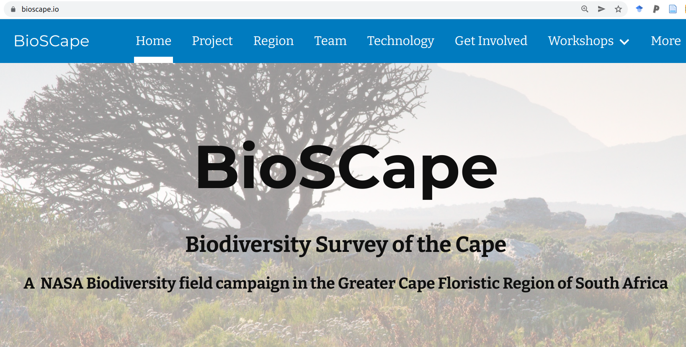
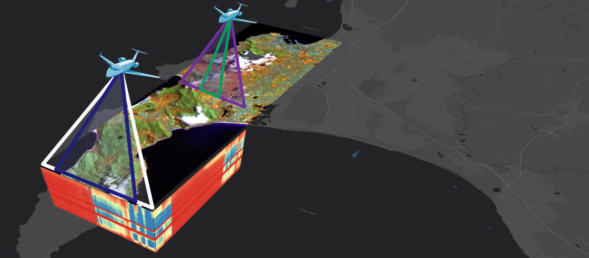

```{r setup, include=FALSE}
options(htmltools.dir.version = FALSE)
knitr::opts_chunk$set(
  fig.width=9, fig.height=3.5, fig.retina=3,
  out.width = "100%",
  cache = FALSE,
  echo = TRUE,
  message = FALSE, 
  warning = FALSE,
  hiline = TRUE
)

library(RefManageR)
BibOptions(check.entries = FALSE,
           bib.style = "authoryear",
           cite.style = "alphabetic",
           style = "markdown",
           hyperlink = FALSE,
           dashed = FALSE)
myBib <- ReadBib("bib/2_species.bib", check = FALSE)
```

```{r xaringan-themer, include=FALSE, warning=FALSE}
library(xaringanthemer)

# style_duo_accent(
#   primary_color = "#1381B0",
#   secondary_color = "#FF961C",
#   inverse_header_color = "#FFFFFF"
# )

style_mono_light(base_color = "#23395b")

#https://mycolor.space/?hex=%2323395B&sub=1 
#"Generic gradient" - #23395B #006287 #008E9D #00B897 #89DD81 #F9F871
#"Matching gradient" (reverse) - #23395B #494E77 #716292 #9C77AA #C88DBF #F5A3D0


library(knitr)
library(kableExtra)
```


```{r xaringan-tile-view, echo=FALSE}
# xaringanExtra::use_tile_view()
```

## "The completion of conservation planning..."

### [Brooks 2010 in _Conservation Biology for All_](https://doi.org/10.1093/acprof:oso/9780199554232.003.0012)

 "...conservation planning is a discipline with its completion in sight. It is not too far of a stretch to imagine a day where..." [we have]:
 
- complete and continuous updating of IUCN Red List assessments of all species [and ecosystems]
- iterative identification of key biodiversity areas, representing all sites of global conservation significance
- measurement and mapping of:
    - the continuous global surface of seascape and landscape scale ecological processes necessary to retain these species and sites into the future
    - the threats to these species, sites, and sea/landscapes, and of the costs and benefits of conserving them.
- free, electronic, continuously updated access to these datasets, and tools for their interpretation, planning, and prioritization

> "A particularly important characteristic of such a vision is its iterative nature."

---

## My take?

We'll never be able to automate conservation planning (and actions), but we certainly can do better to automate (or at east semi-automate) data collection, processing (including modelling) and dissemination to decision makers.

```{r echo = F, fig.align = 'center', out.width = '60%'}

```

.footnote[[Slingsby et al. 2023. _Regional ecological forecasting across scales: A manifesto for a biodiversity hotspot._](http://dx.doi.org/10.1111/2041-210x.14046)]

---

## We're starting to do this...

```{r echo = F, fig.align = 'center', out.width = '55%'}

```

.left[.footnote[[www.emma.eco](https://www.emma.eco/)]]
---

class: center, middle

### If we want to monitor biodiversity everywhere, all the time...

```{r echo = F, fig.align = 'center', out.width = '80%'}
knitr::include_graphics("images/world_seasonality.gif")
```

.center[...satellite remote sensing is pretty much the only way this can be achieved!]

---

layout: false

.pull-left[

## Remote sensing of biodiversity 
#### A rapidly growing field!!!

```{r echo = F, fig.align = 'center', out.width = '70%'}
knitr::include_graphics("images/turner2003.png")
```

```{r echo = F, fig.align = 'center', out.width = '70%'}
knitr::include_graphics("images/satellitelaunches.jpg")
```

]

.pull-right[

```{r echo = F, fig.align = 'left', out.width = '77%'}
knitr::include_graphics("images/cavenderbares2020.png")
```

]

---

class: center, middle

## But how do we actually measure biodiversity with remote sensing?

---

layout: false

.pull-left[
## There are many facets of biodiversity to measure!

<br>

An advantage of remote sensing is that it can directly measure the structure, composition and function of biodiversity... 

...at least from the scale of individuals up...

..., but we can also use proxies and models to infer finer scales.

]

.pull-right[
```{r echo = F, fig.align = 'center', out.width = '100%'}
knitr::include_graphics("images/Noss_Biodiversity.png")
```
.footnote[Noss 1990, _Conservation Biology_]
]

---

layout: false

.pull-left[
## There are many facets of biodiversity to measure!

An advantage of remote sensing is that it can directly measure the structure, composition and function of biodiversity... 


```{r echo = F, fig.align = 'center', out.width = '120%'}
knitr::include_graphics("images/skidmore2021_fig1.png")
```
.footnote[[Skidmore et al. 2021](http://dx.doi.org/10.1038/s41559-021-01451-x)]

]

.pull-right[

```{r echo = F, fig.align = 'center', out.width = '90%'}
knitr::include_graphics("images/ebv_circle.png")
```


...at least from the scale of individuals up...

.footnote[https://geobon.org/]

]

---

## And many sensor types that can measure them!

.left-column[

Active vs passive sensors

Multispectral vs hyperspectral (imaging spectrometers)

Much variation within each type 

- Especially spectral range and resolution!

.footnote[[Pettorelli et al. 2018](http://dx.doi.org/10.13140/RG.2.2.25962.41926)]
]

.right-column[
```{r echo = F, fig.align = 'center', out.width = '75%'}

```

]


---

background-image: url("images/nasa_ems.jpeg")
background-size: contain

text-color: white

.left-column[
## The Electromagnetic Spectrum
]

---

class: center, middle

### Remote sensing is particularly useful in combo with other observations

```{r echo = F, fig.align = 'center', out.width = '60%'}

```

.footnote[[Turner 2014](https://doi-org.ezproxy.uct.ac.za/10.1126/science.1256014)]

---

class: center

## Productivity and Seasonality

```{r echo = F, fig.align = 'center', out.width = '90%'}
knitr::include_graphics("images/world_seasonality.gif")
```

---

class: center

##Land cover and ecosystem mapping

```{r echo = F, fig.align = 'center', out.width = '85%'}

```

.left[.footnote[https://remap-app.org/]]

---

class: center

##Land cover (and change)

```{r echo = F, fig.align = 'center', out.width = '50%'}
knitr::include_graphics("images/skowno2021.jpg")
```

.left[.footnote[[Skowno et al. 2021](http://dx.doi.org/10.17159/sajs.2021/8182)]]

---

class: center

##Land cover change time series

```{r echo = F, fig.align = 'center', out.width = '60%'}

```

.left[.footnote[Moilwe et al. in prep]]

---

class: center

##Land cover change detection

```{r echo = F, fig.align = 'center', out.width = '70%'}
knitr::include_graphics("images/renosterveld_planet.gif")
```

.left[.footnote[[Moncrieff 2022](http://dx.doi.org/10.3390/rs14122766)]]

---

class: center

##Land cover change detection

```{r echo = F, fig.align = 'center', out.width = '70%'}
knitr::include_app("https://www.globalforestwatch.org/map/", 
  height = "400px")
```

.left[.footnote[www.globalforestwatch.org - but clearly erroneous in places due to lack of local knowledge!!!]]

---

class: center

## Detecting subtle changes in ecological condition

```{r echo = F, fig.align = 'center', out.width = '100%'}

```

.left[.footnote[[Slingsby et al. 2021](http://dx.doi.org/10.1016/j.isprsjprs.2020.05.017) and _in prep_. - _Requires a model for how the local ecosystem should behave!_]]

---

class: center

## Detecting subtle changes in ecological condition

```{r echo = F, fig.align = 'center', out.width = '100%'}
knitr::include_graphics("images/medecos2.png")
```

.left[.footnote[[Slingsby et al. 2021](http://dx.doi.org/10.1016/j.isprsjprs.2020.05.017) and _in prep_. - _Requires a model for how the local ecosystem should behave!_]]

---

class: center

## Detecting subtle changes in ecological condition

```{r echo = F, fig.align = 'center', out.width = '100%'}
knitr::include_graphics("images/medecos3.png")
```

.left[.footnote[[Slingsby et al. 2021](http://dx.doi.org/10.1016/j.isprsjprs.2020.05.017) and _in prep_. - _Requires a model for how the local ecosystem should behave!_]]

---

class: center, middle

## These tools give an indication of the status of ecosystems or of species' habitat,...

###...but what about more direct measures of biodiversity like species, functional and phylogenetic diversity?

---

layout: false

.pull-left[
## Functional diversity?

```{r echo = F, fig.align = 'center', out.width = '100%'}
knitr::include_graphics("images/peninsula_lidar.png")
```

Proteaceae shrubs (dark green) surrounded by low shrubs, forbs and graminoids at Silvermine, TMNP. 

.footnote[Data from City of Cape Town]

]

.pull-right[
```{r echo = F, fig.align = 'center', out.width = '100%'}
knitr::include_graphics("images/purkis_klemas2011_lidar.png")
```

Light detection and ranging (LiDAR) allows you to measure topography and the vertical structure of vegetation.

.footnote[Purkis and Klemas 2011]
]

---

layout: false

.pull-left[
## Functional diversity?

Imaging spectroscopy ("hyperspectral" remote sensing) allows direct measurement of leaf traits.

```{r echo = F, fig.align = 'left', out.width = '92%'}
knitr::include_graphics("images/cawse2021_spectra.png")
```

]

.pull-right[
```{r echo = F, fig.align = 'center', out.width = '100%'}
knitr::include_graphics("images/peninsula_hyperspec.png")
```
]

---

layout: false

## Phylogenetic diversity?

```{r echo = F, fig.align = 'center', out.width = '70%'}
knitr::include_graphics("images/meireles2020.jpg")
```

.center[.footnote[Meireles et al. 2020]]

Leaf spectra are phylogenetically conserved for some regions, so it's possible that we'll be able to discern lineages using imaging spectroscopy...

---

layout: false

.pull-left[
## Identifying species?

We can monitor populations of large species..., but identifying all species present...?

```{r echo = F, fig.align = 'center', out.width = '60%'}
knitr::include_graphics("images/machine_learning.png")
```

.footnote[https://xkcd.com/1838/]
]

.pull-right[
```{r echo = F, fig.align = 'center', out.width = '75%'}
knitr::include_graphics("images/cedars_pic.png")
knitr::include_graphics("images/cedars_mapped.png")
```

.footnote[[Slingsby and Slingsby 2019](http://dx.doi.org/10.7717/peerj.7005), Hadebe 2021 MSc thesis]
]

---

class: center

##There are challenges and limitations...

```{r echo = F, fig.align = 'center', out.width = '50%'}
knitr::include_graphics("images/schimel2020_scale.png")
```

.left[.footnote[Schimel et al. 2020]]

---

class: center

## Spectral unmixing can detect "spectral signatures"

.left-column[

```{r echo = F, fig.align = 'center', out.width = '100%'}

```
]

.right-column[

Map species or cover types based on their reflectance of the electromagnetic spectrum!

```{r echo = F, fig.align = 'center', out.width = '40%'}
knitr::include_graphics("images/jonaskop_spectral_library.png")
```

Given a library of spectral signatures of different species and land cover types (endmembers), spectral unmixing infers the composition of each pixel from the possible mixes of endmembers. This gives a cover map of the majority endmember for each pixel (as here) and the fraction of each endmember for all pixels (next slide).

]

---

class: center

## Spectral unmixing can detect "spectral signatures"

```{r echo = F, fig.align = 'center', out.width = '100%'}
knitr::include_graphics("images/jonaskop_unmix.png")
```

.left[.footnote[ We can map species (e.g. pines) or land cover types based on their reflectance of the electromagnetic spectrum!]]

---

layout: false

.pull-left[
## Combining remote sensing and in situ data

Using remotely sensed environmental data to inform species distribution models

```{r echo = F, fig.align = 'center', out.width = '100%'}
knitr::include_graphics("images/wilson2016.png")
```

E.g. Observed cloud frequency from the MODIS satellite is a better predictor of the distribution of _Protea cynaroides_ than interpolated precipitation.

.footnote[Wilson and Jetz 2016]

]

.pull-right[
```{r echo = F, fig.align = 'center', out.width = '100%'}
knitr::include_graphics("images/randin2020.jpg")
```
.footnote[Randin et al. 2020]
]

---

layout: false

.pull-left[
## The Spectral Diversity Hypothesis

Is spectral diversity a good proxy for biotic diversity?

```{r echo = F, fig.align = 'left', out.width = '100%'}
knitr::include_graphics("images/frye2021map.png")
```

]

.pull-right[
```{r echo = F, fig.align = 'center', out.width = '90%'}
knitr::include_graphics("images/frye2021fig.png")
```

A test looking at spectral diversity from leaf spectra for 1210 species across 1267 plots supports the hypothesis **at the leaf level...**

.footnote[Frye et al. 2021]
]

---

layout: false

.pull-left[
### Environmental heterogeneity

Another approach is just to map and monitor environmental heterogeneity

####_"Conserving nature's stage"_

The Nature Conservancy and others using this approach to identify parcels of Earth that are valuable for their capacity to support diverse life forms today and into the future

Typically identified based on their abiotic heterogeneity or geodiversity, much of which can be mapped and/or monitored with remote sensing - topography, climate, soils, etc

]

.pull-right[
```{r echo = F, fig.align = 'center', out.width = '90%'}
knitr::include_graphics("images/humboldt.jpg")
```
.footnote[Alexander von Humboldt]
]

---

## Advocacy and awareness

```{r echo = F, fig.align = 'center', out.width = '60%'}
knitr::include_graphics("images/assam-india.gif")
```

Images from space provide a greater awareness and connection with the planet - termed "the overview effect"

.footnote[Google Earth Timelapse (Google, Landsat, Copernicus)]

---

class: center

```{r echo = F, fig.align = 'center', out.width = '100%'}

```
.left[.footnote[...and the Cape is about to be the epicentre of this endeavour - https://www.bioscape.io/]]

---

layout: false

## BioSCape: Biodiversity Survey of the Cape

.pull-left[

- $>$ 100 scientists and conservation practitioners
- 16 teams (mixed US, RSA, other)
- terrestrial and aquatic
- 2 planes
- 4 instruments (hyperspectral and LiDAR)
- fundamental and applied science

```{r echo = F, fig.align = 'center', out.width = '100%'}

```

]

.pull-right[
```{r echo = F, fig.align = 'center', out.width = '100%'}
knitr::include_graphics("images/bioscape_kumu.png")
```
.footnote[www.bioscape.io]
]

---

background-image: url("images/Bioscape infographic_e3.jpg")
background-size: contain

---
class: middle

## Take-home

>*Spatially explicit biodiversity and environmental data, monitored over the long term, but made available in near-real-time, are a critical basis for conservation planning and management*
> - *satellite remote sensing is pretty much the only way this can be achieved*

>*There are many ways to measure biodiversity (or factors affecting biodiversity like fire or weather), and satellite data can be used to measure a large number of them*

>*The number and variety of satellite sensor types is rapidly expanding, providing new and better ways to measure biodiversity all the time!*

>*Some aspects of biodiversity are not directly observable from satellites (e.g. small species, or diversity metrics like species richness or phylogenetic diversity), but can often be inferred using proxies or models.*

>*Ground data are essential for calibrating and validating almost any remotely-sensed data product.*

>*Local understanding of the ecology of the species or ecosystems under study is essential for the interpretation (and often analysis) of almost any biodiversity-related remote sensing product*
> - *Many global products fall short because of this issue*

---
class: center, middle

# Thanks!

Slides created via the R packages:

[**xaringan**](https://github.com/yihui/xaringan)<br>
[gadenbuie/xaringanthemer](https://github.com/gadenbuie/xaringanthemer)

The chakra comes from [remark.js](https://remarkjs.com), [**knitr**](http://yihui.name/knitr), and [R Markdown](https://rmarkdown.rstudio.com).
