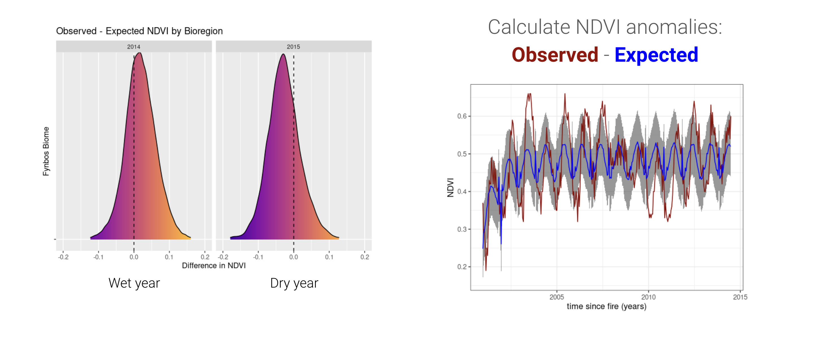
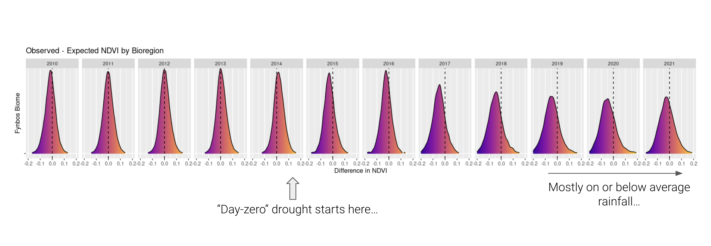
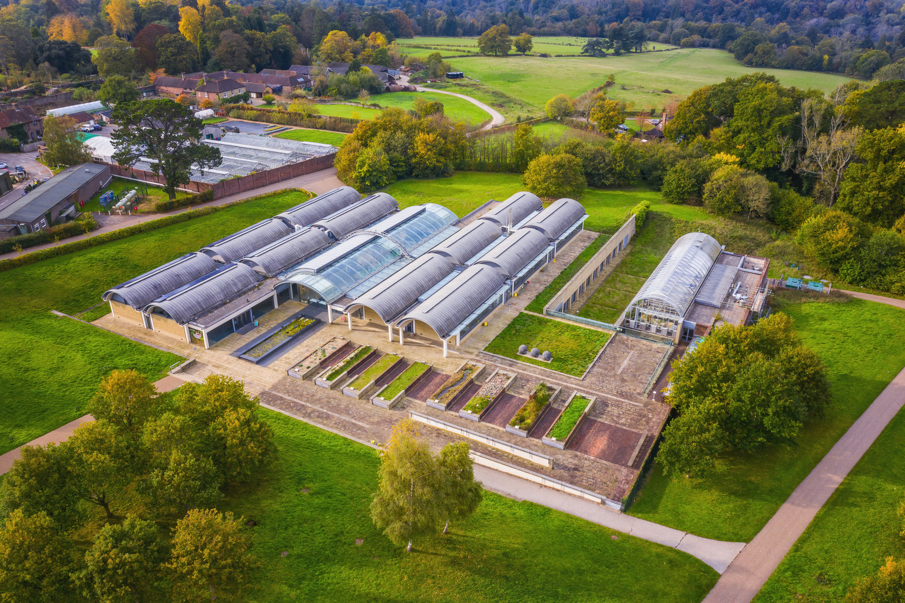

```{r setup, include=FALSE}
options(htmltools.dir.version = FALSE)
knitr::opts_chunk$set(
  fig.width=9, fig.height=3.5, fig.retina=3,
  out.width = "100%",
  cache = FALSE,
  echo = TRUE,
  message = FALSE, 
  warning = FALSE,
  hiline = TRUE
)

library(RefManageR)
BibOptions(check.entries = FALSE,
           bib.style = "authoryear",
           cite.style = "alphabetic",
           style = "markdown",
           hyperlink = FALSE,
           dashed = FALSE)
myBib <- ReadBib("bib/2_species.bib", check = FALSE)
```

```{r xaringan-themer, include=FALSE, warning=FALSE}
library(xaringanthemer)

# style_duo_accent(
#   primary_color = "#1381B0",
#   secondary_color = "#FF961C",
#   inverse_header_color = "#FFFFFF"
# )

style_mono_light(base_color = "#23395b")

#https://mycolor.space/?hex=%2323395B&sub=1 
#"Generic gradient" - #23395B #006287 #008E9D #00B897 #89DD81 #F9F871
#"Matching gradient" (reverse) - #23395B #494E77 #716292 #9C77AA #C88DBF #F5A3D0


library(knitr)
library(kableExtra)
```


```{r xaringan-tile-view, echo=FALSE}
# xaringanExtra::use_tile_view()
```

class: center, middle

### Is putting a fence around it enough?

---

## The Assumptions of Protecting Area...

.pull-left[
- Setting land aside should:  
  - Safeguard species and ecosystems
  - Provide ecosystem services

- But this assumes:  
  - Habitats and species ranges are stable
  - Static boundaries suffice  
  - Pressures can be kept out
  - Necessary processes are intact and do not rely on unprotected areas
      - (e.g. fire, hydrology, migration)
  - Protected areas are effectively managed...
]  

.pull-right[

```{r echo = F, fig.align = 'centre', out.width = '100%'}

```

.footnote[Yellowstone National Park by [Henry Wellge (1850-1917)](https://commons.wikimedia.org/w/index.php?curid=43155865)]

]

---

class: center, middle

## Protected area effectiveness?

```{r echo = F, fig.align = 'centre', out.width = '55%'}
knitr::include_graphics("images/protected_areas_map.png")
```

Protected Areas (PAs) cover ~17% of land and ~8% of oceans ***BUT*** climate change and other threats are reshaping ecosystems and undermining their effectiveness at protecting biodiversity...

.footnote[Global protected areas from [Bingham et al. 2019](http://dx.doi.org/10.1038/s41559-019-0869-3)]


---

## Determinants of Protected Area Effectiveness

.pull-left[
The effectiveness of a protected area in achieving the desired conservation outcomes is influenced by two main factors:

- **Protected Area Management Effectiveness (PAME)**: How well the PA is managed, including planning, enforcement, resource allocation, community engagement, etc.
- **Change Drivers**: External pressures such as climate change, invasive species, pollution, altered ecosystem processes and land-use change that can impact the PA's ecosystems and biodiversity and the extent to which we can mitigate or adapt to them.

Unfortunately, both are hugely challenging!
]

.pull-right[
```{r echo = F, fig.align = 'centre', fig.width = 4, fig.height = 3, out.width = '100%'}
library(plotrix)

old_par <- par(no.readonly = TRUE) # Store current par settings
par(mar = c(0, 0, 0, 0))

# Create a new plot
plot(NA, xlim = c(0, 10), ylim = c(0, 10), 
     xlab = "", ylab = "", axes = FALSE, main = "")

# Draw the first circle
draw.circle(x = 3, y = 5, radius = 2, border = "blue")
text(x = 3, y = 5, labels = "Management\nEffectiveness")

# Draw the second circle, overlapping the first
draw.circle(x = 6, y = 5, radius = 2, border = "darkgreen")
text(x = 6, y = 5, labels = "Change\nDrivers")

par(old_par) # Restore original par settings
```
]

---

## Protected Area Management Effectiveness (PAME)

.pull-left[

There are a number of different PAME methodologies, but most are based on a similar framework and share common elements, e.g.:
- Planning: Clear objectives, zoning, management plans, etc
- Resources: Adequate funding, staffing, infrastructure
- Enforcement/implementation: Effective patrolling, law enforcement and other management activities
- Community Engagement: Involving local communities and stakeholders
- Monitoring and Evaluation: Regular assessment of management effectiveness and ecological outcomes

]

.pull-right[
```{r echo = F, fig.align = 'centre', out.width = '80%'}

```

.footnote[Framework for assessing management effectiveness of protected areas ([Hockings et al. 2006](https://portals.iucn.org/library/efiles/documents/PAG-014.pdf)).]
]

---

## Protected Area Management Effectiveness (PAME)


> "_According to the global database on PAME, in 2020 only 18.29% of the area covered by protected areas has been evaluated._" - [Gurney et al. 2023](https://doi.org/10.1016/j.oneear.2023.01.012)

--

.pull-left[
South Africa employs an adapted version of the the Management Effectiveness Tracking Tool (METT), called METT-SA.

[Cowan et al. 2010](https://www.dffe.gov.za/sites/default/files/reports/research/biodiversity/management_effectiveness_saprotected_areas.pdf) assessed 230 (±78%) of SA's PA:

>"_Total scores ranged from 10% to 86%, with a total mean of 49%_ 

> - _108 (47%) scores were below the mean,_
> - _121 (53%) above the mean and_ 
> - _only 31 (14%) above the 67% level for sound management._"

]

.pull-right[

```{r echo = F, fig.align = 'centre', out.width = '100%'}

```

.footnote[[Cowan et al. 2010](https://www.dffe.gov.za/sites/default/files/reports/research/biodiversity/management_effectiveness_saprotected_areas.pdf)]

]

---

## Protected Area Management Effectiveness (PAME)

.pull-left[

Very few indicators scored above 50% on average, let alone the 67% level for sound management...

<br>

South Africa is among the better countries for assessing PAME globally, but there is still much room for improvement!

.footnote[[Cowan et al. 2010](https://www.dffe.gov.za/sites/default/files/reports/research/biodiversity/management_effectiveness_saprotected_areas.pdf)]
]

.pull-right[

```{r echo = F, fig.align = 'centre', out.width = '90%'}

```

]

---

.pull-left[

```{r echo = F, fig.align = 'centre', out.width = '90%'}

```

]

.pull-right[

## Change Drivers?

Protected areas are subject to all the usual suspects...

Some of these they are aimed at combating (e.g. habitat loss), while others may not have been anticipated when the PA was established (e.g. climate change, invasive species).

Some can be managed, given sufficient resources (e.g. invasive species), while others are largely out of the control of PA managers (e.g. climate change).

.footnote[[Franklin et al. 2016](https://doi.org/10.1073/pnas.1519911113)]
]

---

.pull-left[

```{r echo = F, fig.align = 'centre', out.width = '90%'}

```

]

.pull-right[

## Change Drivers?

Protected areas are subject to all the usual suspects...

Some of these they are aimed at combating (e.g. habitat loss), while others may not have been anticipated when the PA was established (e.g. climate change, invasive species).

Some can be managed, given sufficient resources (e.g. invasive species), while others are largely out of the control of PA managers (e.g. climate change).

Unfortunately,...

- many are intensifying, and most interact...
- we don't fully understand how they'll affect biodiversity, or how best to manage their impacts...

.footnote[[Franklin et al. 2016](https://doi.org/10.1073/pnas.1519911113)]
]


---

## Climate change anomalies in South Africa's PAs

.pull-left[
```{r echo = F, fig.align = 'centre', out.width = '100%'}

```
]

.pull-right[
```{r echo = F, fig.align = 'centre', out.width = '100%'}

```
]

.footnote[Significant change in our National Parks ([van Wilgen et al. 2015](http://dx.doi.org/10.1002/joc.4377))]

---

## Climate change impacts in South Africa's PAs

.pull-left[
```{r echo = F, fig.align = 'centre', out.width = '100%'}

```
]

.pull-right[
```{r echo = F, fig.align = 'centre', out.width = '100%'}

```

Weather extremes in the first summer after fires are causing local species loss.

]

.footnote[Cape of Good Hope, TMNP ([Slingsby et al. 2017](https://doi.org/10.1073/pnas.1619014114))]

---

class: center

## Climate change impacts in South Africa's PAs?

```{r echo = F, fig.align = 'center', out.width = '100%'}
knitr::include_graphics("images/medecos1.png")
```

.left[.footnote[[Slingsby et al. 2021](http://dx.doi.org/10.1016/j.isprsjprs.2020.05.017) and _in prep_. - Detecting changes in ecosystem structure and function from remote sensing data.]
]

---

class: center

## Climate change impacts in South Africa's PAs?

```{r echo = F, fig.align = 'center', out.width = '100%'}

```

.left[.footnote[[Slingsby et al. 2021](http://dx.doi.org/10.1016/j.isprsjprs.2020.05.017) and _in prep_. - - Detecting changes in ecosystem structure and function from remote sensing data.]
]

---

class: center

## Climate change impacts in South Africa's PAs?

```{r echo = F, fig.align = 'center', out.width = '100%'}

```

.left[.footnote[[Slingsby et al. 2021](http://dx.doi.org/10.1016/j.isprsjprs.2020.05.017) and _in prep_. - - Detecting changes in ecosystem structure and function from remote sensing data.]
]

---

## But Climate Change is more than change in time...

.pull-left[
We're used to seeing climate records and climate change projections as time-series, but climate also varies in space...
]

.pull-right[
```{r echo = F, fig.align = 'centre', out.width = '100%', fig.cap = "IPCC AR6 illustrative mitigation pathways (IMPs)."}
knitr::include_graphics("images/IPCC-SRL-image-4.png")
```

]

---

.pull-left[

## Climate Change Velocity

The combination of climate varying in space and changing over time means that average climate conditions are shifting in space over time. 

Species and ecosystems may need to move to track their climate niche...

The rate at which climate conditions are shifting in space is called **climate velocity**.

Climate velocities are not uniform across the landscape, and can be very high in flat areas with shallow climate gradients (e.g. tundra, oceans) and low in mountainous areas with steep climate gradients.

]

.footnote[[Loarie et al. 2009](https://doi.org/10.1038/nature08649)

]

.pull-right[
```{r echo = F, fig.align = 'center', out.width = '100%'}
knitr::include_graphics("images/loarie1.webp")
```
]

---

## Multiple Dimensions of Climate Change...

.pull-left[

The different local and regional dimensions of climate change have different implications for species and ecosystems and their conservation.

Local dimensions relate to what species/ecosystems have to cope with in situ (e.g. warming, drying, extremes)

Regional dimensions relate to how far species/ecosystems may need to move to track their climate niche (e.g. climate velocity, direction, distance to suitable climate and barriers to movement).

]

.pull-right[
```{r echo = F, fig.align = 'center', out.width = '100%'}

```

.footnote[[Garcia et al. 2014](http://dx.doi.org/10.1126/science.1247579)]

]

---

## Protected Areas and Shifting Climate...

.pull-left[

Protected areas may not be located in areas that will remain suitable for the species and ecosystems they were established to protect.

Protected areas often protect fragments of the landscape (and thus climate space), and may not be large or connected enough to allow species to move in response to climate change.

Having only fragments of the habitat and climate space of species or ecosystems may make them more vulnerable to extinction or collapse.

]

.pull-right[
```{r echo = F, fig.align = 'center', out.width = '100%', fig.cap = "CC = Climate Change, LT = Landscape Transformation"}

```

.footnote[[Ntshanga 2022 _PhD thesis_](http://dx.doi.org/10.1126/science.1247579)]

]

---

## Protecting Areas under Climate Change

.pull-left[
A systematic review by [Ranius et al (2022)](https://doi.org/10.1007/s13280-022-01779-z) identified 5 key principles for climate-smart protected area design and management (_adaptation_ options):

- Ensure sufficient connectivity;
- Protect climate refugia; 
- Protect a few large rather than many small areas; 
- Protect areas predicted to become important for biodiversity in the future;
- Complement  permanently  protected  areas  with temporary protection.
]

.pull-right[
```{r echo = F, fig.align = 'center', out.width = '100%'}

```

.footnote[[Ranius et al 2022](https://doi.org/10.1007/s13280-022-01779-z)]

]

---

## Protecting Areas under Climate Change

The above address **direct impacts** of climate change:
- Species loss, or range shifts towards cooler areas
- Phenological mismatches (e.g. flowers and pollinators)
- Habitat loss (corals, alpine, Arctic)

...but there are also **indirect impacts** and interactions with other change drivers:
- Invasive species
- Disturbance regimes (fire, storms, pests)
- Hydrological change

Often, the most important first step is to manage these interacting threats better...


---

.left-column[
## Park-level Climate Vulnerability?

A combination of potential impacts and adaptive capacity...

i.e. linked to change drivers and management effectiveness (slide 5)

.footnote[[Coldrey et al 2022](https://doi.org/10.1111/cobi.13941)]

]

.right-column[
```{r echo = F, fig.align = 'center', out.width = '90%', fig.cap = "There's more to the picture than just the impacts..."}
knitr::include_graphics("images/coldrey2022.jpg")
```
]

---

## What about species the protected areas can't protect?

.pull-left[
### Assisted migration?

Left to right: 

**Assisted population migration**
  — The human-assisted movement of populations within a species’ established range — Lower risk
  
**Assisted range expansion**
  — The human-assisted movement of species to areas just outside their established range, facilitating or mimicking natural range expansion — Intermediate risk

**Assisted long-distance migration** — The human-assisted movement of species to areas far outside their established range (beyond areas accessible through natural dispersal) — Higher risk
]

.pull-right[
```{r echo = F, fig.align = 'center', out.width = '100%'}

```

.footnote[[USDA](https://www.climatehubs.usda.gov/hubs/northwest/topic/northwest-reforestation-planting-suit-current-and-future-climates)]
]

---

## What about species the protected areas can't protect?

.pull-left[

### _Ex situ_ conservation?
  - Botanical gardens, zoos, etc

But most facilities are already at capacity... And even these collections are vulnerable to loss - disease, funding, etc

```{r echo = F, fig.align = 'center', out.width = '100%'}

```
]

.pull-right[
```{r echo = F, fig.align = 'center', out.width = '80%'}

```


.footnote[[Cano et al. 2025](https://doi.org/10.1038/s41559-024-02633-z)]
]

---

## What about species the protected areas can't protect?

.pull-left[

### Seed banks
  - [Millennium Seed Bank Partnership](https://www.kew.org/wakehurst/whats-at-wakehurst/millennium-seed-bank)
  - [Svalbard Global Seed Vault](https://seedvaultvirtualtour.com/)

<br>

> _"to keep every cog and wheel..."_

]

.pull-right[
```{r echo = F, fig.align = 'center', out.width = '100%'}

```

]

---

## Protected Areas and Climate Mitigation?

**Mitigation roles:** 

--

- Carbon storage (forests, peatlands, mangroves).
- Avoided deforestation.  
- REDD+ and policy integration.  
- Co-benefits for biodiversity and ecosystem services.
- Ecosystem-based adaptation (EbA).

---

## Protected Areas and Climate Mitigation?

```{r echo = F, fig.align = 'center', out.width = '70%', fig.cap = "Differences in Aboveground Biomass Density (AGBD), forest height, canopy cover, and Plant Area Index (PAI) between PAs and matched unprotected areas."}
knitr::include_graphics("images/duncanson5.webp")
```

.footnote[[Duncanson et al. 2023](https://doi.org/10.1038/s41467-023-38073-9)]

---
class: middle

## Take-home


> - PA effectiveness depends on both management and external pressures.
- Global change drivers like climate change undermine the static PA model.  
- Climate-smart approaches require connectivity, adaptation, and integration.
- Unfortunately, there is much we have yet to learn...
    - But we're improving our tools for monitoring and learning (and thus managing PAs)
- PA can contribute to climate mitigation via carbon storage.

---
class: center, middle

# Thanks!

Slides created via the R packages:

[**xaringan**](https://github.com/yihui/xaringan)<br>
[gadenbuie/xaringanthemer](https://github.com/gadenbuie/xaringanthemer)

The chakra comes from [remark.js](https://remarkjs.com), [**knitr**](http://yihui.name/knitr), and [R Markdown](https://rmarkdown.rstudio.com).
