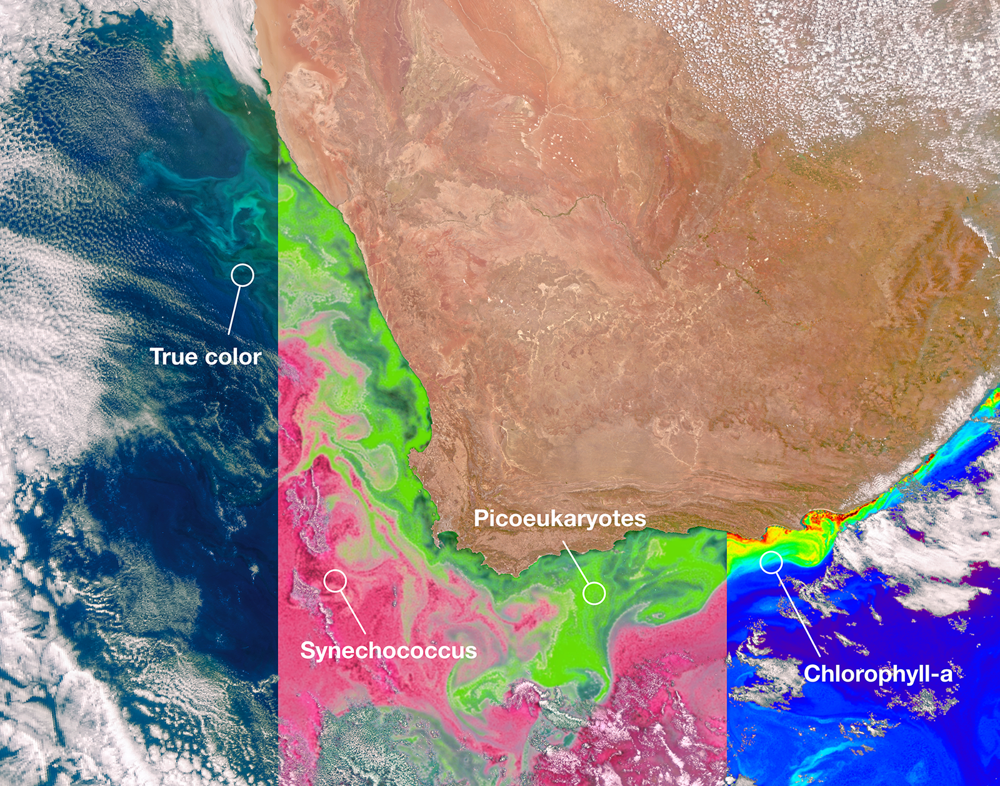

```{r setup, include=FALSE}
options(htmltools.dir.version = FALSE)
knitr::opts_chunk$set(
  fig.width=9, fig.height=3.5, fig.retina=3,
  out.width = "100%",
  cache = FALSE,
  echo = TRUE,
  message = FALSE, 
  warning = FALSE,
  hiline = TRUE
)

library(RefManageR)
BibOptions(check.entries = FALSE,
           bib.style = "authoryear",
           cite.style = "alphabetic",
           style = "markdown",
           hyperlink = FALSE,
           dashed = FALSE)
myBib <- ReadBib("bib/2_species.bib", check = FALSE)
```

```{r xaringan-themer, include=FALSE, warning=FALSE}
library(xaringanthemer)

# style_duo_accent(
#   primary_color = "#1381B0",
#   secondary_color = "#FF961C",
#   inverse_header_color = "#FFFFFF"
# )

style_mono_light(base_color = "#23395b")

#https://mycolor.space/?hex=%2323395B&sub=1 
#"Generic gradient" - #23395B #006287 #008E9D #00B897 #89DD81 #F9F871
#"Matching gradient" (reverse) - #23395B #494E77 #716292 #9C77AA #C88DBF #F5A3D0


library(knitr)
library(kableExtra)
```


```{r xaringan-tile-view, echo=FALSE}
# xaringanExtra::use_tile_view()
```


class: center, middle

### This is a discussion, not a lecture. These slides may not make much sense in isolation...

---

## Lecture 1, Slide 11:

### The tough questions...

- Where should we put (or expand) protected areas?
- How do we ensure the effectiveness of our protected areas?
- How do we protect biodiversity outside protected areas?

--

Answering these requires (key themes):
  - Mapping biodiversity
  - Identifying and assessing threats to biodiversity
  - Deciding on biodiversity conservation priorities
  - Optimising trade-offs in priorities for protected area design
  - Tools to inform management
    - Early warning systems
    - Monitoring change in biodiversity and other key variables (e.g. fire, land cover change, etc)

---

## Lectures

.pull-left[

- Intro: Space and Conservation
- Area-Based Conservation
- Threat assessments
- Remote Sensing of Biodiversity
- Guest lecture by **Dr Andrew Skowno**, SANBI
- Discussion of Gurney et al. 2023
- Guest lecture by **Dr Ralph Watson**, UCT
- Guest lecture by **Dr Glenn Moncrieff**, The Nature Conservancy
- Protecting Area in a Changing World

]

.pull-right[

```{r, echo=FALSE}
knitr::kable(
  
  data.frame(
    Theme = c("Mapping biodiversity",
                  "Assessing threats to biodiversity",
                  "Deciding on priorities",
                  "Optimising trade-offs in priorities",
                  "Tools to inform management"),
    Andrew = c("X", "X", "X", "X", "X"),
    Ralph = c("X", "", "", "", ""),
    Glenn = c("X", "X", "X", "X", "X"))
)
```

]
---

# Cross-cutting themes

- Local vs Global: priorities, policy, planning, analyses and actions

--

- Policy:
    - Global: CBD - Aichi targets, Global Biodiversity Framework, SDGs, etc
    - National Legislation: NEM:BA
    - National policy tools/instruments/informants: NBA, NBSAPs, National Protected Area Expansion Strategies
    - Provincial and municipal policies and plans

--

- Information to action pipeline:
    - Indicators - for reporting nationally and to global commitments (e.g. CBD)
    - Maps - for application in planning (e.g. priorities) and management
    - Messaging - focus on creating light (awareness) vs heat (conflict)

--

- Inside vs outside protected areas
    - Protected area effectiveness and management tools (I)
    - Protected area expansion/design (O)
    - Land use planning and EIAs (O)
    - Restoration and sustainable use (O)
    
---

# Cross-cutting themes cont.

- Measuring impact (often comparing inside vs outside PAs)
    - Effectiveness of protected areas / Impact of conservation actions 
    - Attribution and additionality (are we doing better than the baseline)
    - TNC planning for impact (i.e. prioritising sites with the greatest threats)

--

- Expanding set of priorities
    - Biodiversity > ecosystem services > climate change > human well-being
    - Clear in IUCN timeline, but also in Glenn and Andrew's talks re TNC and SANBI approach
    - More hooks to achieve conservation, but also more complexity and trade-offs!
    
--

- Increased focus on repeatability/reproducibility of methods
    - allow regular updates and comparisons over time or between regions/countries
    - transparency and trust

- Increased focus on forecasting 
    - of impacts - to help plan/prioritise conservation actions
    - of biodiversity - to help decision making and/or assess effectiveness of conservation actions

---

# Other observations

Evolution of Remote Sensing:
- From measuring the environment to direct measures of biodiversity
- From single date to time series
- From single sensor to multiple sensors
- Complex models to integrate multiple data sources

Ralph's approach vs prac?
- Prac = supervised classification
    - We specified the classes and training data
- Ralph = unsupervised classification + field validation
    - Let the data tell us what the classes are
    - Needs validation!
    - Some level of expert input through decisions on input data and number of classes

---

class: center, middle

```{r echo = F, fig.align = 'center', out.width = '65%'}

```

We're starting to directly map components of biodiversity...

---

class: center, middle

# Thanks!

Slides created via the R packages:

[**xaringan**](https://github.com/yihui/xaringan)<br>
[gadenbuie/xaringanthemer](https://github.com/gadenbuie/xaringanthemer)

The chakra comes from [remark.js](https://remarkjs.com), [**knitr**](http://yihui.name/knitr), and [R Markdown](https://rmarkdown.rstudio.com).
